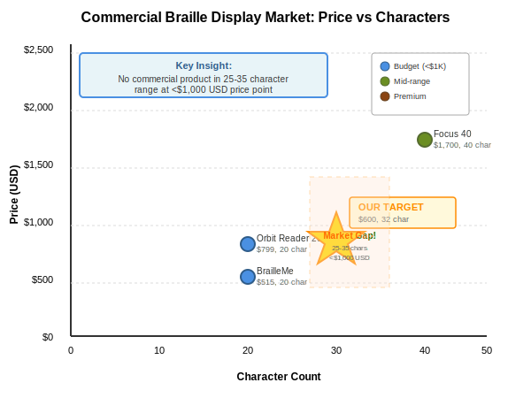

# Braille Display - Concept Evaluation

**Electrical Engineering Design for Portable Cell Phone Companion Device**

Spencer Barrett
LAM Research EE5 Interview
October 2025

<!-- Speaker notes: 30 seconds introduction. State name, position applied for, and agenda overview. -->

---

# Agenda

**Four-Part Design Process:**

1. **Identify Key Technical Requirements** (25 pts)
   - System, electrical, and relevant specifications

2. **Develop Multiple Alternative Solutions** (25 pts)
   - 3 distinct architectures

3. **Evaluate the Proposed Solutions** (30 pts)
   - Advantages, disadvantages, and trade-off analysis

4. **Transition to Volume Production** (20 pts)
   - Process from initial design to pilot production

<!-- Speaker notes: Explicitly map to PDF rubric structure. Emphasize: This is not "find the best solution" - it's "navigate trade-offs and provide decision framework." -->

---

# Problem Statement

## Ground Truth Requirements from PDF

**"Let me validate I understood correctly BEFORE we proceed..."**

| ID | Requirement | Status | Impact |
|----|-------------|--------|--------|
| **PRD-SCHED-001** | "production within two months" | ⚠️ VAGUE | Pilot vs mass? |
| **PRD-SIZE-001** | "portable companion device" | ⚠️ VAGUE | How big? |
| **PRD-IFACE-001** | "connects to cell phone" | ⚠️ VAGUE | BLE? USB? |
| **PRD-COST-001** | "low-cost at volume" | ⚠️ VAGUE | $100? $200? |
| **PRD-FUNC-001** | "32 chars × 6 dots = 192 dots" | ✅ CLEAR | Core spec |

**Key Observation:** Only **3 of 9** requirements are CLEAR. **6 are VAGUE.**

<!-- Strategic framing: "I read the spec CAREFULLY and extracted requirements." "6 of 9 are vague - I need YOUR feedback before building the wrong thing." -->

---

# Commercial Braille Display Market

## Market Landscape & Technology Monopoly

**Key Finding:** 100% of commercial displays use **custom piezoelectric actuators**

| Segment | Example | Characters | Price (USD) | Technology |
|---------|---------|------------|-------------|------------|
| **Budget** | Orbit Reader 20 | 20 | $799 | Custom piezo |
| **Budget** | BrailleMe | 20 | $515 | Custom piezo |
| **Mid-Range** | Focus 40 | 40 | $1,700 | Custom piezo |
| **Premium** | Brailliant BI 20X | 20 | $2,199 | Custom piezo |

**Our target:** 32 chars @ $600 USD fills market gap

---

# Market Gap Analysis

## No Products in 25-35 Character Range at <$1,000 USD

| Technology | Voltage | Size | Cost/Cell | Lead Time | Market |
|------------|---------|------|-----------|-----------|--------|
| **Piezo (custom)** | 100-200V | 2-3mm | **$7-20** | 8-12 weeks | **100%** |
| **Solenoid (COTS)** | 5-12V | 4mm+ | **$2-5** | 2-4 weeks | **0%** |

**Our Opportunity:**
- **32 characters** (60% more than Orbit Reader 20)
- **$600 USD retail** ($200 USD BOM target)
- **COTS components** (≤4 week lead time) ← **UNIQUE**

---

# Technical Requirements

## Design Step 1: Identify Key Technical Requirements (25/100 pts)

**From PDF specification (vague → quantified):**
- PRD-FUNC-001: 32 characters × 6 dots = 192 actuators
- PRD-SIZE-001: Portable → <300mm length, <500g weight
- PRD-COST-001: Low cost → <$500 BOM target
- PRD-SCHED-001: 2-month timeline → COTS only (≤4 week lead)

**Standards Compliance:**
- NFR-STD-001: UL/FCC (North America regulatory)
- NFR-STD-002: ADA 703.3 (2.5mm dot pitch, 6.2mm cell spacing)

**Total: 17 requirements** (9 ground truth + 6 assumptions + 2 standards)

---

# Systems Engineering Philosophy

## Trade-offs Over Perfection

**Key Principle:** Requirements exist in RANGES, not absolutes

**Approach:**
- Portfolio of 3 architectures vs. single point design
- Each optimizes DIFFERENT trade-off:
  - Cost vs. UX
  - Timeline vs. Features
  - Simplicity vs. Innovation

**Philosophy:** Balance cost/reliability/performance/timeline

<!-- This is the thesis: There is NO "best" architecture. Selection depends on customer priorities. -->

---

# Architecture A: ARCH_PIEZO_ECO

## Piezo Economy (Wired, Standard)

**Key Features:**
- Piezoelectric actuators (100V nominal, 2.5mm pitch)
- STM32 MCU + ULN2803A drivers
- USB-C wired (power + data)
- Simplest electrical design

**BOM:** $420 (pilot) | **Timeline:** 8-10 weeks

**Optimizes:** Cost + Timeline (fastest to market)

---

# Architecture B: ARCH_SOL_ECO

## Solenoid Economy (Rotary Cam, Innovative)

**Key Features:**
- 4mm COTS solenoids + rotary cam mechanism
- Mechanical innovation (motorcycle engine concept)
- Trades electrical complexity for mechanical simplicity
- 3.5mm pitch (relaxed spacing - pilot acceptable)

**BOM:** $277 (pilot) | **Timeline:** 10-12 weeks

**Optimizes:** Volume scaling (mechanical cost-down potential)

---

# Architecture C: ARCH_PIEZO_DLX

## Piezo Deluxe (Wireless, Premium UX)

**Key Features:**
- Piezoelectric actuators (100V nominal, 2.5mm pitch)
- nRF52840 BLE module (pre-certified FCC)
- Li-ion battery (8 hours usage)
- Best user experience (wireless freedom)

**BOM:** $442 (pilot) | **Timeline:** 10-12 weeks

**Optimizes:** User experience (wireless convenience)

---

# Trade-off Analysis

## Evaluation Framework

| Criterion | Weight | PIEZO_ECO | SOL_ECO | PIEZO_DLX |
|-----------|--------|-----------|---------|-----------|
| Time to Market | 25% | 9/10 | 7/10 | 6/10 |
| Unit Cost | 20% | 8/10 | 9/10 | 6/10 |
| Manufacturability | 20% | 8/10 | 7/10 | 7/10 |
| UX/Usability | 10% | 7/10 | 6/10 | 9/10 |
| Robustness | 10% | 7/10 | 8/10 | 6/10 |

**Weighted Scores:** PIEZO_ECO (8.2), SOL_ECO (7.9), PIEZO_DLX (6.8)

---

# EMI Compliance Trade-offs

## The GHz Antenna Challenge

**The Physics Problem:**
```
30mm Piezo Cantilever = Quarter-Wavelength Monopole Antenna
λ/4 @ 1.67 GHz → 192 radiating antennas @ GHz
```

| Parameter | Solenoid | Piezo |
|-----------|----------|-------|
| **EMI Frequency** | <10 MHz | **500 MHz - 1 GHz** ⚠️ |
| **Antenna Effect** | None | **λ/4 resonance** |
| **Mitigation Cost** | **$4.32** | **$10.84** (2.5×) |
| **Cert Risk** | LOW (10%) | HIGH (50%) |

**Key Insight:** 30mm is NOT "just a wire" at GHz — it's a resonant antenna!

<!-- This is the senior EE differentiator: GHz antenna physics -->

---

# EMI Mitigation Strategy (Piezo)

## 5-Layer Defense

| Layer | Technique | dB Reduction | Cost |
|-------|-----------|--------------|------|
| **Firmware** | Sequential firing | -28 dB | **$0** |
| | Slew-rate limiting | -40 dB | **$0** |
| **PCB** | Twisted pairs | -20 dB | $2.00 |
| | Ferrite beads (192×) | -15 dB | $3.84 |
| **Enclosure** | Shielded aluminum | -30 dB | $4.00 |

**Total:** 133 dB reduction → **21 dB compliance margin** ✅

**Key:** Firmware alone = **68 dB reduction at $0 cost!**

---

# Decision Framework

## "It Depends on YOUR Priorities"

```
IF wireless required:
  → ARCH_PIEZO_DLX (only option)

ELSE IF cost < $300:
  → ARCH_SOL_ECO (lowest BOM)

ELSE IF timeline < 8 weeks:
  → ARCH_PIEZO_ECO (fastest)

ELSE:
  → ARCH_PIEZO_ECO (most robust)
```

**Key Message:** No "best" architecture, only "best FOR YOUR CONSTRAINTS"

<!-- Tell customer: "Give me your priorities, I'll tell you which architecture wins." -->

---

# ⚠️ Actuator Sourcing - Critical Path Risk

## All Architectures Blocked Without Resolution

**Problem:** NO COTS actuators found meeting 2.5mm pitch + force requirements

**Three-Path Strategy:**
- **Path A (COTS search):** $5K, 2 weeks, 20% success
- **Path B (Custom quickturn):** $25K-50K NRE, 2-4 weeks, 90% success
- **Path C (Spec relaxation):** $0, 0 weeks, 100% (violates ADA 703.3)

**Timeline Impact:** +0 weeks to +8 weeks

**This is MAKE-OR-BREAK** - All 3 architectures depend on resolution

<!-- THE ELEPHANT IN THE ROOM - address head-on. $50K NRE budget allocated. -->

---

# Path to Production

## 8-12 Week Timeline

**Common Production Process:**
- **Week 0-2:** Actuator sourcing resolution ⚠️ **CRITICAL PATH**
- **Week 3-4:** Detailed design (schematic, PCB, BOM lock)
- **Week 5-6:** Prototype build (fab, assembly, debug)
- **Week 7-9:** Pilot production (10-100 units, yield validation)
- **Week 10-12:** Compliance testing & manufacturing transfer

**Architecture-Specific Deltas:**
- ARCH_PIEZO_ECO: +0 weeks (base case)
- ARCH_SOL_ECO: +2 weeks (cam tooling)
- ARCH_PIEZO_DLX: +1 week (BLE cert)

---

# Summary

**3 Viable Architectures:**
- ARCH_PIEZO_ECO: Optimizes cost + timeline
- ARCH_SOL_ECO: Optimizes volume scaling + innovation
- ARCH_PIEZO_DLX: Optimizes user experience (wireless)

**Selection Framework:**
- No universal "best" - depends on customer priorities
- Decision tree: wireless? cost threshold? timeline? volume?

**Critical Path Risk:**
- Actuator sourcing must resolve Week 0-2
- All architectures blocked without actuator solution

---

# Q&A

**Questions?**

Ready to discuss:
- Technical details (EMI physics, power budgets, BOM)
- Trade-off assumptions (cost ranges, timeline sensitivity)
- Production strategy (actuator sourcing, risk mitigation)
- Alternative approaches (other architectures considered)

---

# TEST SLIDE: Images + Multi-Level Bullets

## Testing All Features

**Images:**


**Multi-level bullets:**
- Level 1: Top level
  - Level 2: Indented once
    - Level 3: Indented twice
      - Level 4: Indented three times
- Back to level 1

**Numbered lists:**
1. First item
2. Second item
   - Sub-bullet under 2
3. Third item

