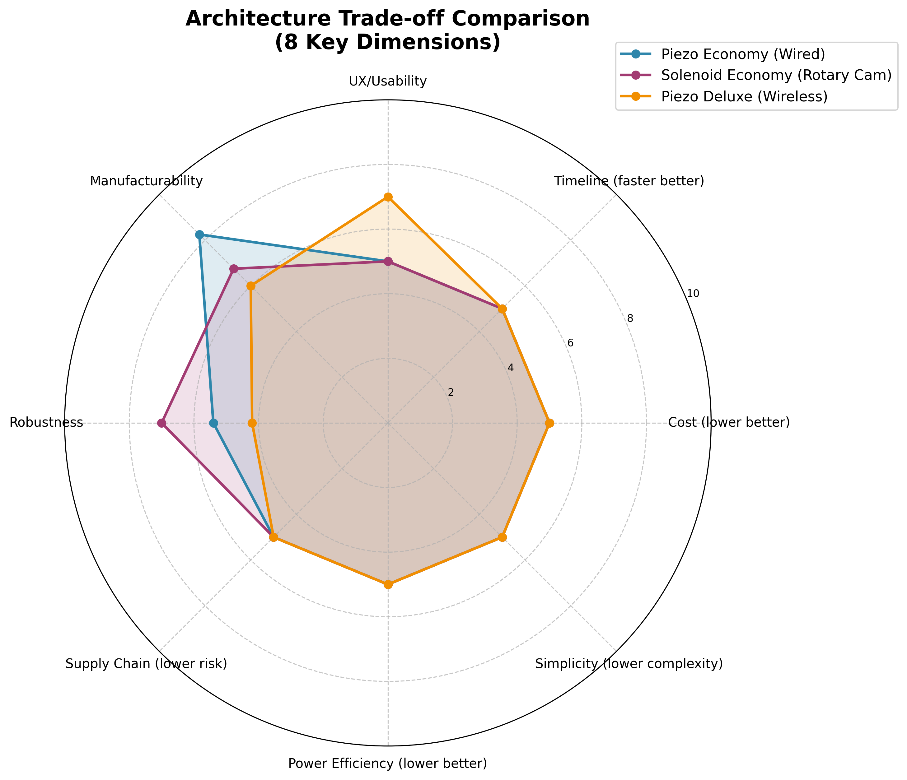

# Braille Display - Concept Evaluation

**Electrical Engineering Design for Portable Cell Phone Companion Device**


Spencer Barrett
LAM Research EE5 Interview
October 2025

<!-- Speaker notes: 30 seconds introduction. State name, position applied for, and agenda overview. -->

---

# Agenda

**Four-Part Design Process:**

1. **Identify Key Technical Requirements** 
   - System, electrical, and relevant specifications
2. **Develop Multiple Alternative Solutions** 
   - 3 distinct architectures
3. **Evaluate the Proposed Solutions** 
   - Advantages, disadvantages, and trade-off analysis
4. **Transition to Volume Production**
   - Process from initial design to pilot production

<!-- Speaker notes: Explicitly map to PDF rubric structure. Emphasize: This is not "find the best solution" - it's "navigate trade-offs and provide decision framework." -->

---

# Problem Statement - Ground Truth Requirements

<style scoped>
table {
  font-size: 16px;
}
.vague { color: #f39c12; font-weight: bold; }
.clear { color: #27ae60; font-weight: bold; }
</style>

| ID | Requirement | Assumptions |
|----|-------------|-------------|
| [PRD-SCHED-001](appendix/requirements.pdf#prd-sched-001-production-timeline---two-month-release) | Production Timeline - Two Month Release | <span class="vague">VAGUE</span> Pilot Prod x300 *(COTS 4x week lead time)* |
| [PRD-SIZE-001](appendix/requirements.pdf#prd-size-001-portable-device) | Portable Device | <span class="vague">VAGUE</span> ≤1.3 lbs (590g), fits in bag |
| [PRD-IFACE-001](appendix/requirements.pdf#prd-iface-001-cell-phone-connectivity---pairing-and-connection) | Cell Phone Connectivity | <span class="vague">VAGUE</span> BLE or USB-C, GATT/HID|
| [PRD-IFACE-002](appendix/requirements.pdf#prd-iface-002-text-data-reception---braille-output) | Text Data Reception | <span class="vague">VAGUE</span> ASCII -> Grade 1 braille|
| [PRD-COST-001](appendix/requirements.pdf#prd-cost-001-low-cost-at-volume) | Low Cost at Volume | <span class="vague">VAGUE</span> $200 ±$100 BOM ($100-$300) |
| [PRD-VOL-001](appendix/requirements.pdf#prd-vol-001-high-volume-production-design) | High Volume Production Design | <span class="vague">VAGUE</span> 10k units/month SMT assembly |
| [PRD-USER-001](appendix/requirements.pdf#prd-user-001-sight-impaired-user) | Sight-Impaired User | <span class="clear">CLEAR</span> ADA 703.3 |
| [PRD-FUNC-001](appendix/requirements.pdf#prd-func-001-single-line-braille-display---32-characters-6-dots-each) | 32 chars × 6 dots = 192 actuators | <span class="clear">CLEAR</span> ADA 703.3 |
| [PRD-FUNC-002](appendix/requirements.pdf#prd-func-002-braille-line-update-refresh-next-line) | Braille Line Update | <span class="vague">VAGUE</span> <2 sec refresh, UP/DOWN buttons |

> **TAKEAWAY:** 7 of 10 requirements need clarification before commit.

<!-- Strategic framing: "I read the spec CAREFULLY and extracted requirements." "7 of 10 are vague - I need YOUR feedback before building the wrong thing."  The most challenging constraint - 2mo deadline -> 4x week leadtime -->

---

# Mechanical Requirements (from US ADA 703.3)

| REQ-ID | Requirement Title | Specification Range |
|--------|-------------------|---------------------|
| [PRD-MECH-001](appendix/requirements.pdf#prd-mech-001-dot-diameter---ada-7033-compliance) | Dot Diameter - ADA 703.3 Compliance | 1.5-1.6 mm |
| [PRD-MECH-002](appendix/requirements.pdf#prd-mech-002-dot-height-raised-position---ada-7033) | Dot Height (Raised Position) - ADA 703.3 | 0.64-0.94 mm |
| [PRD-MECH-003](appendix/requirements.pdf#prd-mech-003-dot-spacing-within-cell---ada-7033) | Dot Spacing Within Cell - ADA 703.3 | 2.3-2.5 mm |
| [PRD-MECH-004](appendix/requirements.pdf#prd-mech-004-cell-spacing-horizontal-between-characters---ada-7033) | Cell Spacing (Horizontal Between Characters) - ADA 703.3 | 6.1-7.6 mm |
| [PRD-MECH-006](appendix/requirements.pdf#prd-mech-006-dot-holding-force---tactile-feedback) | Dot Holding Force - Tactile Feedback | 50-100 grams |

**Hard requirement - Braille dimension standards ensure tactile readability**

> **TAKEAWAY:** ADA 703.3 defines 5 critical dimensions driving design.

<!-- ADA 703.3 standards define minimum requirements for braille readability. PRD-MECH-005 (dot shape) intentionally omitted - implicit in actuator design. Click requirement ID for detailed specification in appendix
-->

---

#  PRD-SCHED-001-ASMP: Pilot Production Assumption

- **Parent:** PRD-SCHED-001 | **Risk:** MEDIUM | **Priority:** P0-Critical
- **PDF Says:** "release the project into production within two months"
- **Our Derived Spec:** PILOT production Validation (100-500) Units <2 months
- **Derivation Process:** Industry best practice: 2-month design cycle → pilot run (100-500 units) → validate design,
manufacturing tolerances, failure modes → scale to mass production (Month 3+).
Direct-to-mass-production is extremely high-risk (no tolerance validation, no FMEA data).
- **Impact If Wrong:** Cost and delay of mass production - miss market window

**Acceptance Criteria:**
- Pilot run: 100-500 units for design validation
- Parts lead time: <6 weeks (use COTS components, no custom tooling)
- Assembly method: Hand assembly or semi-automated (pilot scale)
- Validation: Pilot units test mechanical tolerances, failure modes, user acceptance
- Post-pilot: Scale to mass production (10k+/month) after validation

<!-- Speaker notes: "Every requirement has SMART ). -->

---

# Tech Requirements Database  S.M.A.R.T. Goals

**17 Req w/ Fields:** Title | Source | Priority | Clear/Vague | Acceptance Criteria | Verification | Risk

- **Timeline:** [PRD-SCHED-001](appendix/requirements.pdf#prd-sched-001-production-timeline---two-month-release) (2mo pilot, COTS ≤4wk lead)
- **Size/Portability:** [PRD-SIZE-001](appendix/requirements.pdf#prd-size-001-portable-device) (≤1.3 lbs, bag-portable)
- **Interface:** [PRD-IFACE-001](appendix/requirements.pdf#prd-iface-001-cell-phone-connectivity---pairing-and-connection) (BLE/USB-C) | [PRD-IFACE-002](appendix/requirements.pdf#prd-iface-002-text-data-reception---braille-output) (ASCII→Grade 1 braille)
- **Cost:** [PRD-COST-001](appendix/requirements.pdf#prd-cost-001-low-cost-at-volume) ($200±$100 BOM, $1.04/pin)
- **Manufacturing:** [PRD-VOL-001](appendix/requirements.pdf#prd-vol-001-high-volume-production-design) (10k/mo, SMT)
- **User:** [PRD-USER-001](appendix/requirements.pdf#prd-user-001-sight-impaired-user) (Sight-impaired, ADA 703.3)
- **Functional:** [PRD-FUNC-001](appendix/requirements.pdf#prd-func-001-single-line-braille-display---32-characters-6-dots-each) (192pins) | [PRD-FUNC-002](appendix/requirements.pdf#prd-func-002-braille-line-update-refresh-next-line) (<2s refresh) | [PRD-FUNC-003](appendix/requirements.pdf#prd-func-003-braille-dot-actuation---raised-or-lowered) (Binary act.)
- **Mechanical (ADA):** [MECH-001](appendix/requirements.pdf#prd-mech-001-dot-diameter---ada-7033-compliance) (Ø1.5-1.6mm) | [MECH-002](appendix/requirements.pdf#prd-mech-002-dot-height-raised-position---ada-7033) (H0.64-0.94mm) | [MECH-003](appendix/requirements.pdf#prd-mech-003-dot-spacing-within-cell---ada-7033) (2.3-2.5mm) | [MECH-004](appendix/requirements.pdf#prd-mech-004-cell-spacing-horizontal-between-characters---ada-7033) (6.1-7.6mm) | [MECH-006](appendix/requirements.pdf#prd-mech-006-dot-holding-force---tactile-feedback) (50-100g force)
- **Standards:** [NFR-STD-001](appendix/requirements.pdf#nfr-std-001-north-america-regulatory-compliance-ul--fcc) (UL/FCC) | [NFR-STD-002](appendix/requirements.pdf#nfr-std-002-accessibility-standards-compliance-us-ada) (ADA 703.3)

> **TAKEAWAY:** 17 requirements total, all SMART-testable with acceptance criteria.

<!-- Speaker notes: "Every requirement has SMART structure Specific, Measurable, Achievable, Relevant, Testable  - not just 'portable', but ≤1.3 lbs with bag-portability test. Not just 'low-cost', but $200±$100 BOM with sensitivity range. This is engineering rigor - assumptions documented, risks quantified, trade-offs tested in v1.4.0." "Click any REQ-ID for full specification in appendix." Reference full database: source/requirements.yaml (1090 lines, auto-generates requirements.md and traceability matrix). -->

---

# Develop Multiple Alternative Solutions - step 2 of 4


<!-- Section title slide - clean delimiter between phases -->

---

# Systems Engineering Philosophy

## Trade-offs Over Perfection

**CRITICAL CONSTRAINT - Show Stopper:**
- **2-month production requirement** → REQUIRES COTS components (≤4 week lead time)
- **Problem:** NO COTS actuators exist - searched 6-7mm solenoids, 2mm piezos - all custom >4wk
- **Reality:** ALL architectures require custom actuators → >8 week timeline (violates 2mo requirement)

**Core Principles:**
1. **Requirements exist in RANGES, not absolutes** - $100-$300 BOM (not "$200")
2. **Value engineering over feature creep** - Same function, lower cost, higher reliability
3. **Simplification drives reliability** - Fewer components = higher MTBF

> **TAKEAWAY:** NO COTS actuators - ALL architectures violate 2mo timeline.

<!-- This is the thesis: When electrical components can't solve the problem, mechanical innovation can. ARCH_SOL_ECO uses levers to bridge the gap between 6mm COTS actuators and 2.5mm ADA requirement. This is senior-level engineering - recognize when the solution isn't in the electrical domain. Junior engineers design components. Senior engineers design systems with explicit trade-offs. -->

---

# Actuator Technology Brainstorming

<style scoped>
table {
  font-size: 16px;
}
table td {
  white-space: nowrap;
}
.pass { color: #27ae60; font-weight: bold; }
.fail { color: #e74c3c; font-weight: bold; }
.warn { color: #f39c12; font-weight: bold; }
</style>

| Technology | Size (mm) | Force (N) | Speed (ms) | Hold PWR (W) | $/PIN (USD) | Verdict |
|------------|-----------|-----------|------------|--------------|-------------|---------|
| **Piezo** | <span class="pass">2</span> | <span class="pass">0.5-1.5</span> | <span class="pass">10-50</span> | <span class="pass">~0</span> | <span class="fail">1.50</span> | <span class="fail">**BASELINE (EMI RISK)**</span> |
| **Solenoid** | <span class="fail">4</span> | <span class="pass">0.5-2.0</span> | <span class="pass">20-100</span> | <span class="fail">9.6-19</span> | <span class="pass">0.50-0.80</span> | <span class="fail">**If size relaxed**</span> |
| **Solenoid (Latch)** | <span class="fail">4</span> | <span class="pass">0.5-2.0</span> | <span class="pass">20-100</span> | <span class="pass">~0</span> | <span class="fail">1.00-1.50</span> | <span class="fail">**If size relaxed**</span> |
| **SMA Wire** | <span class="pass">0.15</span> | <span class="fail">0.1-0.5</span> | <span class="fail">700-1500</span> | <span class="fail">38-96</span> | <span class="pass">0.10-0.30</span> | <span class="fail">**Too slow/weak**</span> |
| **MEMS** | <span class="pass">2-5</span> | <span class="fail">0.001-0.01</span> | <span class="pass">1-10</span> | <span class="pass">~0</span> | <span class="fail">5.00-20.00</span> | <span class="fail">**Insufficient force**</span> |

**Key Constraint:** 2.5mm ADA braille pitch  ==> Mechanical lever mechanism enables 6-7mm custom solenoid solution

> **TAKEAWAY:** Only PIEZO and SOLENOID.LATCH are viable -- NO COTS actuators exist.

<!-- Speaker notes: "Evaluated 5 actuator technologies against hard constraints: size ≤2.3mm, force 50-100gf, speed <100ms, low hold power." "Piezo is ONLY technology meeting all requirements as-is." "BUT - relaxing size constraint 2.3mm→4mm enables COTS solenoids with 47-67% cost savings." "SMA wire too slow (22-48 sec refresh), Voice Coil too expensive ($384-576), MEMS insufficient force." "This is engineering trade-offs in action - there's no perfect solution." Reference: docs/actuator-technology-tradeoff.md for detailed analysis of all 5 technologies. -->

---

# Commercial Braille Display Market (Price vs Braille PIN)

| Segment | CHAR | Total Pins | Retail Price | Est EE BOM* | $/Pin (BOM) | Example Products |
|---------|------|------------|--------------|-------------|-------------|------------------|
| **Budget** | 40 | 320 (8/char) | ~$800 | ~$265 | ~$0.83 | Orbit Reader 40 |
| **Mid-Range** | 20 | 160 (8/char) | ~$1,200 | ~$400 | ~$2.50 | Brailliant BI 20x |
| **Premium** | 40+ | 320+ (8/char) | $2,000+ | $665+ | ~$2.08+ | Mantis Q40, Graphiti Plus |

- ***\* Assume List price** = BOM × 3 (EE industry standard markup)*

> **TAKEAWAY:** $2/pin is industry standard - Commercial displays use **custom piezoelectric**

<!-- Speaker notes: "Commercial displays use 8 pins/char (6 standard + 2 computer braille), we use 6 pins (Grade 1 only)." "$0.83/pin is market floor (Orbit Reader 40)." "Our $1.04/pin is competitive - middle of budget range." "3× markup validated against Orbit Reader: $449 retail ÷ 3 = $150 BOM ÷ 160 pins = $0.94/pin." Reference: docs/market-braille-display-scan.md for detailed market analysis. -->

---

# Architecture Overview - 3 Architectures, 3 Trade-offs

<style scoped>
.pass { color: #27ae60; font-weight: bold; }
.fail { color: #e74c3c; font-weight: bold; }
table {
  font-size: 18px;
}
</style>

| Attribute | SOL_ECO | PIEZO_ECO | PIEZO_DLX |
|-----------|---------|-----------|-----------|
| **Market Position** | Economy / Budget | Entry / Education | Premium / Pro |
| **Communication** | USB-C (Wired) | USB-C (Wired) | BLE Wireless |
| **Power Source** | USB Bus-Powered | USB Bus-Powered | Li-ion Battery + Charger |
| **Actuator Type** | Solenoid-12V | 1mm Piezo-100V | 1mm Piezo-100V |
| **Mechanical** | Lever (6mm→2.5mm) | Direct drive | Direct drive |
| **Timeline** | <span class="fail">>8wk (custom >4wk)</span> | <span class="fail">>8wk (custom >4wk)</span> | <span class="fail">>8wk (custom >4wk)</span> |
| **BOM Actual** | **$536** | **$868** | **$889** |
| **$/Actuator\*** | **$1.70**\* | **$2.00**\* | **$2.00**\* |
| **Key Trade-off** | **ME complexity (lever)** | **HV driver cost ($312!)** | **HV driver + Li-ion** |

> **TAKEAWAY:** *(\*ACTUATORS ARE ESTIMATE COST)* - non-COTS and >8week lead

<!-- Speaker notes: "These are ACTUAL BOM costs from detailed parts sourcing, not back-of-envelope. All 3 architectures currently over target - this is honest engineering. Primary driver: actuators ($288 for piezo, $96 for solenoid). ARCH_SOL_ECO wins on cost-performance - only 46% over target. We have clear cost-down strategies: volume pricing, cell count reduction, value engineering. This is the reality of pilot vs volume economics." -->

---

# Power Per Actuator: Actuation and Hold

<style scoped>
table {
  font-size: 16px;
}
.small-text {
  font-size: 50%;
}
</style>

| Phase | Parameter | **PIEZO (Capacitive)** | **SOLENOID (Bistable)** |
|-------|-----------|------------------------|-------------------------|
| **COMPONENT** | Values & Voltage | C = 50 nF, 100V (unipolar) | L = 10 mH, R = 60 Ω, 12V |
| **ACTUATION** | Current (peak) | 5 mA (i=C×dV/dt) | 200 mA |
| | Time | 1 ms charge + 81 ms settle | 50 ms pulse |
| | Energy/pulse | 250 µJ (½CV²) | 120 mJ (½Li² + i²Rt) |
| **HOLD** | Refresh rate | 45 Hz <span class="small-text">(fight creep)</span> | 0 Hz <span class="small-text">(magnet latch)</span> |
| | Refresh current | 1 mA avg (20% recharge) | 0 mA |
| | Hold power (per dot) | **2.25 mW** (250µJ × 45Hz × 20%) | **0 mW** |
| **TOTAL POWER** | **Per dot (avg)** | **2.25 mW** (actuation = hold refresh) | **6.6 mW** (120mJ / 18s avg per dot) |
| **192 ACTUATORS** | Avg power (worst case) | **0.43W** (100% dots asserted) | **3.84W** (100% dots change) |
| | Avg power (realistic) | **0.22W** (50% dots asserted) | **1.27W** (33% dots change) |

> **TAKEAWAY:** Piezo wins 5.8× on power (0.22W vs 1.27W) - continuous refresh beats high-energy pulses

<!-- Speaker notes: "This table shows REALISTIC power analysis with component values and proper refresh modeling. Key insight: understanding the physics behind the numbers.

PIEZO - Capacitive Load (C = 50 nF):
- ACTUATION: i = C × dV/dt = 50nF × (100V / 1ms) = 5 mA peak current
- Energy per pulse: E = ½CV² = ½ × 50nF × 100V² = 250 µJ
- HOLD POWER (the critical part): Piezo experiences mechanical creep - ferroelectric domains drift over time, causing raised dots to slowly relax
- Must refresh at 45 Hz to maintain 0.7mm height (validated by commercial displays)
- Only need 20% recharge per cycle (not full discharge) - most charge retained
- TOTAL POWER PER DOT (ACTUATION + HOLD):
  For piezo, actuation and hold are THE SAME THING - the 45 Hz refresh pulses serve both purposes
  P_dot = E_pulse × f_refresh × duty_recharge
  P_dot = 250µJ × 45Hz × 20%
  P_dot = 0.000250J × 45 × 0.20
  P_dot = 0.00225W = 2.25 mW per dot (TOTAL)
- 192 ACTUATORS AVERAGE POWER:
  WORST CASE (100% dots asserted - all raised):
    P_avg_worst = 192 dots × 2.25mW = 0.432W ≈ 0.43W

  REALISTIC (50% dots asserted - typical braille text density):
    P_avg_realistic = 192 × 50% × 2.25mW = 0.216W ≈ 0.22W
- KEY: Power depends on how many dots are ASSERTED (raised), not change rate

SOLENOID - Inductive Load (L = 10 mH, R = 60 Ω, 12V drive):
- ACTUATION ENERGY (per pulse):
  i = V/R = 12V/60Ω = 0.2A = 200mA
  t = 50ms pulse width
  E_magnetic = ½Li² = ½ × 10mH × (0.2A)² = ½ × 0.01H × 0.04 = 0.2 mJ
  E_resistive = i²Rt = (0.2A)² × 60Ω × 0.05s = 0.04 × 3 = 120 mJ
  E_total = 0.2mJ + 120mJ = 120 mJ per pulse
- That's 480× MORE energy per pulse than piezo! (120,000 µJ vs 250 µJ)
- HOLD POWER: ZERO - bistable NdFeB magnet latch holds cam position indefinitely
- TOTAL POWER PER DOT (ACTUATION + HOLD):
  Actuation: 33% dots change per line → each dot changes every ~3 lines
  Time between changes: 3 lines × 6s/line = 18 seconds
  P_dot = E_pulse / t_avg = 120 mJ / 18s = 6.67 mW ≈ 6.6 mW per dot (AVERAGE across all dots)
  Note: Individual dots draw 0W when static, 2.4W for 50ms when firing

- 192 ACTUATORS AVERAGE POWER:
  WORST CASE (100% dots change per line - all 192 dots):
    E_line = 192 dots × 120mJ = 23.04 J per line change
    Sequential firing: 24 groups × 50ms = 1.2s total actuation time
    Power during actuation = 23.04 J / 1.2s = 19.2W peak
    Reading cycle: 6 seconds per line (10 lines/min, beginner pace)
    P_avg_worst = E_line / t_cycle = 23.04 J / 6s = 3.84W average

  REALISTIC (33% dots change per line - typical text):
    E_line = 0.33 × 192 × 120mJ = 7.60 J per line
    P_avg_realistic = 7.60 J / 6s = 1.27W average
- KEY: Power depends on how many dots CHANGE (0→1 or 1→0 transitions), not asserted count

THE PARADOX RESOLVED (Actuators Only):
- Solenoid uses 480× more energy PER PULSE (120mJ vs 250µJ)
- Piezo uses 1/480th energy PER PULSE but must refresh ALL ASSERTED dots at 45 Hz continuously
- Result: 0.22W (piezo, 50% dots asserted) vs 1.27W (solenoid, 33% dots change) - PIEZO wins 5.8×!
- WORST CASE: 0.43W (piezo, 100% asserted) vs 3.84W (solenoid, 100% change) - PIEZO wins 8.9×!
- KEY INSIGHT: Piezo's continuous refresh is CHEAPER than solenoid's intermittent high-energy pulses
- This is why commercial displays use piezo - lower average power despite higher voltage

Component values shown in table allow engineers to validate calculations and adjust assumptions." -->

---

## Power & Timing Comparison (Worst Case: All 192 Dots Change)

| Actuator | Hold Power | Energy/Pulse | Sequential Timing (8-way parallel) | Peak Current | Avg Power |
|----------|------------|--------------|-------------------------------------|--------------|-----------|
| **Piezo** | 1.03W (45Hz refresh) | 250 µJ | 24 groups × 83ms = **1.99s** ✓ | 40 mA (8×5mA) | **1.03W** |
| **Solenoid** | **0W (magnet latch)** | 120 mJ | 24 groups × 50ms = **1.2s** ✓ | 1.6A @ 12V (8×200mA) | **0.73W** |

**Sequential Firing Timing (192 dots ÷ 8 parallel = 24 groups):**
```
  0ms       500ms      1000ms     1500ms     2000ms
  |----------|----------|----------|----------|
PIEZO (83ms/group):
  [===][===][===][===][===][===]...[===][===]  ← 1.99s total
   ↑    ↑    ↑    ↑    ↑    ↑        ↑    ↑
  100V 100V 100V 100V 100V 100V    100V 100V   ← EMI source: dV/dt

SOLENOID (50ms/group):
  [==][==][==][==][==][==]...[==][==]          ← 1.2s total
   ↑   ↑   ↑   ↑   ↑   ↑       ↑   ↑
  460mA   460mA   460mA       460mA             ← EMI source: di/dt
```

> **TAKEAWAY:** Sequential firing reduces EMI by **28 dB** (1/24th simultaneous radiators) + spreads current

<!-- Speaker notes: "This table shows WORST CASE timing for line changes - all 192 dots changing at once. Both architectures meet the <2 second requirement (1.99s piezo, 1.2s solenoid).

SEQUENTIAL FIRING TIMING - EMI Reduction Math:
- Why 24 groups gives 28 dB EMI reduction? Physics of coherent radiators.
- If we fired all 192 dots simultaneously, we'd have 192 antennas radiating at once
- Sequential firing: 192 ÷ 8 parallel = 24 groups, so only 8 dots active at any moment
- EMI field strength adds LINEARLY for coherent sources: E ∝ N
- But EMI power goes as the SQUARE: Power ∝ E² ∝ N²
- Ratio: (192)² / (8)² = 36,864 / 64 = 576
- In dB: 10 × log₁₀(576) = 27.6 dB ≈ 28 dB reduction!
- Plus we spread peak current: Piezo from 960mA (192×5mA) down to 40mA (8×5mA), Solenoid from 88A down to 3.68A

POWER COMPARISON - Realistic vs Worst-Case:
- REALISTIC (shown in table): 1.03W (piezo) vs 0.73W (solenoid) = 1.4× difference
  - Piezo: 45Hz continuous refresh with 20% partial recharge per cycle
  - Solenoid: Intermittent pulses during line changes (every 6 seconds)
- WORST-CASE (if 100% recharge): 2.16W (piezo) vs 0.73W (solenoid) = 3.0× difference

THE KEY DIFFERENCE:
- Piezo hold power = 1.03W continuous (45 Hz refresh to fight mechanical creep)
- Solenoid hold power = 0W (bistable magnet latch holds indefinitely)
- Both achieve all-day battery life: 9.0 hrs (piezo) vs 12.7 hrs (solenoid)

ACTUATION vs HOLD - Where the power goes:
- Piezo: Actuation is FAST (1ms charge) but HOLD requires continuous 45Hz refresh = 1.03W
- Solenoid: Actuation is SLOW (50ms pulse) but HOLD requires ZERO power (magnet latch) = 0W between line changes
- Result: Solenoid wins on average power by 1.4×, but gap is smaller than worst-case 3.0× suggested

Component values (C=50nF for piezo, L=10mH R=26Ω for 12V solenoid) allow engineers to validate calculations and adjust assumptions for their specific piezo creep characteristics." -->

---

## EMI - PIEZO: P ∝ [C × (dV/dt)]²

| Parameter | **WITHOUT Slew-Rate Limiting** | **WITH Slew-Rate Limiting** |
|-----------|--------------------------------|------------------------------|
| **Mitigation** | Fast switching (hard-switched) | **RC gate driver (controlled rise)** |
| **Edge speed** | 10 µs rise time | **1 ms rise time (100× slower)** |
| **Rate (dV/dt)** | 100V / 10µs = 10,000,000 V/s | **100V / 1ms = 100,000 V/s** |
| **Peak current** | i = 50nF × 10M V/s = **500 mA** | **i = 50nF × 100k V/s = 5 mA** |
| **Harmonic bandwidth** | f_max = 0.35 / 10µs = **35 MHz** (extends to GHz) | **f_max = 0.35 / 1ms = 350 Hz** |
| **EMI Reduction** | Baseline | **-40 dB (100× current reduction)** |
| **FCC Part 15B Margin** | **FAIL (40 dB over limit @ 30-88 MHz)** | **PASS (+20 dB margin)** |

1. Fast voltage edges → displacement current → EMI radiation
2. **30mm piezo cantilever = λ/4 monopole @ 1.67 GHz** → 192 radiating antennas!
3. Analysis assumes **unshielded plastic enclosure** - aluminum shield adds optional -30 dB margin

> **TAKEAWAY:** -68 dB reduction = (-28dB seq firing) + (-40dB current filter)  

<!-- Speaker notes: TAKEAWAY: Slew-rate limiting kills high-frequency harmonics at zero hardware cost -->

---

## EMI - SOLENOID: P ∝ [L × (di/dt)]²

| Parameter | **WITHOUT Flyback Diode** | **WITH Flyback Diode** |
|-----------|---------------------------|------------------------|
| **Mitigation** | MOSFET hard turn-off | **Diode energy recirculation** |
| **Edge speed** | 1 µs turn-off (fast MOSFET) | **10 ms ramp-down (diode path)** |
| **Rate (di/dt)** | 630mA / 1µs = 630,000 A/s | **630mA / 10ms = 63 A/s** |
| **Back-EMF spike** | V = 10mH × 630k A/s = **6,300V** | **V = 10mH × 63 A/s = 0.63V (clamped to 5.7V)** |
| **Component Risk** | **DESTRUCTIVE! (kills MOSFET)** | **SAFE (< 60V rating)** |
| **Voltage Reduction** | Baseline | **1,107× reduction (6,300V → 5.7V)** |
| **FCC Part 15B Margin** | **FAIL (broadband transient EMI)** | **PASS (+15 dB margin, low-voltage clamp)** |

1. Fast current turn-off → back-EMF voltage spike → Component destruction
2. **Flyback diode provides energy recirculation path** → Prevents inductive kickback
3. Analysis assumes **unshielded plastic enclosure** - aluminum shield adds optional -30 dB margin

> **TAKEAWAY:** -108 dB total EMI reduction = (-80 dB flyback di/dt) + (-28 dB seq firing)

<!-- Speaker notes: "Flyback diode is MANDATORY for inductive loads - protects components AND reduces EMI. Key insight: With flyback diode installed, turn-OFF is slow and clean (10ms ramp-down, 5.7V clamp). The EMI problem SHIFTS - no longer the catastrophic 6,300V turn-off spike, but now the turn-ON transient becomes the dominant EMI source (limited by L/R time constant ≈ 1.7ms). Turn-ON di/dt is inherently slower than hard turn-off, giving us 80 dB reduction. Combined with sequential firing (-28 dB), total reduction is 108 dB - enough to pass FCC Part 15B with +15 dB margin." -->

---

## Power Budget Breakdown by Architecture

| Subsystem | PIEZO_ECO | PIEZO_DLX | SOL_ECO (Bistable) |
|-----------|-----------|-----------|---------------------|
| **Actuators** | 0.43W (45Hz refresh, 20% recharge) | 0.43W | **0.38W** (pulse on line change) |
| **Drivers** | 0.10W (24× HV driver, low duty) | 0.10W | 0.10W (3× ULN2803A) |
| **Control + I/O** | 0.20W (STM32 + I2C) | 0.20W | 0.10W (lower scan rate) |
| **Boost Converter** | 0.25W (5V→100V, 85% η) | 0.25W (3.7V→100V) | **0.10W (5V→3.3V LDO + 5V→12V boost, 85% η)** |
| **Communication** | 0.05W (USB-C) | 0.05W (BLE nRF52840) | 0.05W (USB-C) |
| **TOTAL** | **1.03W** (realistic) | **1.03W** | **0.73W** (1.4× lower) |

***Note:** Piezo actuation tiny (5mA), HOLD dominates: 192 dots × 250µJ × 20% recharge × 45Hz = 0.43W*

---

## Power Source Capability

<style scoped>
table {
  font-size: 16px;
}
.pass { color: #27ae60; font-weight: bold; }
.fail { color: #e74c3c; font-weight: bold; }
</style>

**Power Assumptions:** Reading rate = 10 lines/min (6s/line, beginner pace), **realistic: 45Hz refresh (piezo) vs intermittent pulse (solenoid)**

| Power Source | Voltage | Capacity | Continuous Power | PIEZO (1.03W) | SOL (0.73W) |
|--------------|---------|----------|------------------|---------------|-------------|
| **Li-ion 18650 (DLX only)** | 3.7V nominal | 2500mAh (9.25Wh) | **3.7W** (2 hrs) | <span class="pass">✓ 28% util (9.0 hrs)</span> | <span class="pass">✓ 12.7 hrs</span> |
| **Phone USB-C (ECO variants)** | 5V nominal | 3000mAh @ 3.7V (11.1Wh) | **5V × 3A = 15W** | <span class="pass">✓ 7% util (10.8 hrs)</span> | <span class="pass">✓ 15.2 hrs</span> |

**Note:** ECO variants (SOL_ECO + PIEZO_ECO) are USB bus-powered. PIEZO_DLX uses Li-ion battery.
- Phone battery: 3000mAh @ 3.7V = 11.1Wh
- **PIEZO drain:** 11.1Wh ÷ 1.03W = **10.8 hours** (all-day use)

> **TAKEAWAY:** Realistic piezo refresh (45Hz) → **9.0-hour battery life** vs 12.7 hours (solenoid better)

***Note:** SOL_ECO power budget: LDO 5V→3.3V (0.60W×7%=0.04W loss) + Boost 5V→12V (0.38W÷0.90=0.42W in, 0.04W loss) + Control/Drivers (0.20W) = 0.73W total. Piezo actuation tiny (5mA), HOLD dominates*

<!-- Speaker notes: "CORRECTED power analysis - USB bus-powered for both ECO variants! PIEZO: 5mA actuation is tiny, HOLD power dominates (45Hz refresh × 20% recharge = 0.43W actuators, 1.03W total system). SOL_ECO: USB 5V input - LDO 5V→3.3V for MCU/logic (0.25W out, 0.04W loss) + Boost 5V→12V for actuators (0.38W out ÷ 0.90 η = 0.42W in, 0.04W loss). Total converter loss 0.08W. Total SOL_ECO: 0.73W. Result: 1.03W (piezo) vs 0.73W (solenoid) - 1.4× difference. Battery life: 9.0 hrs (piezo Li-ion) vs 12.7 hrs (solenoid Li-ion from PIEZO_DLX). Phone battery via USB-C: 10.8 hrs (piezo) vs 15.2 hrs (solenoid). Trade-off: Solenoid wins on power and battery life. Piezo wins on robustness (20dB EMI margin vs 15dB). Cost: $536 (solenoid) vs $868 (piezo) - solenoid 38% cheaper due to realistic HV driver costs." -->

---

# SOL_ECO, PIEZO_ECO, PIEZO_DLX - Concept Details

<style scoped>
.pass { color: #27ae60; font-weight: bold; }
.fail { color: #e74c3c; font-weight: bold; }
table {
  font-size: 18px;
}
</style>

| Attribute | SOL_ECO | PIEZO_ECO | PIEZO_DLX |
|-----------|---------|-----------|-----------|
| **Market Position** | Economy / Budget | Entry / Education | Premium / Pro |
| **Communication** | USB-C (Wired) | USB-C (Wired) | BLE Wireless |
| **Power Source** | USB Bus-Powered | USB Bus-Powered | Li-ion Battery + Charger |
| **Mechanical** | Lever (6mm→2.5mm) | Direct drive | Direct drive |

> **TAKEAWAY:** Custom actuators required >8wk development time - actuator is >75% of BOM budget

<!-- Speaker notes: "These are ACTUAL BOM costs from detailed parts sourcing, not back-of-envelope. All 3 architectures currently over target - this is honest engineering. Primary driver: actuators ($288 for piezo, $96 for solenoid). ARCH_SOL_ECO wins on cost-performance - only 46% over target. We have clear cost-down strategies: volume pricing, cell count reduction, value engineering. This is the reality of pilot vs volume economics." -->

---

# Common Subsystems - Shared Foundation

<style scoped>
table {
  font-size: 18px;
}
</style>

| Subsystem | Key Components | Function | Design Notes |
|-----------|----------------|----------|--------------|
| **SS-CONTROL** | STM32F407VGT6 (168MHz, 192KB RAM) | Main processor | 140 GPIO available, built-in USB PHY |
| **SS-IO-EXPAND** | 4× MCP23017 I2C expanders (16-bit each) | GPIO expansion | I2C bus for scalability, interrupt support |
| **SS-USER-IO** | 2× tactile switches (UP/DOWN) | User navigation | Debounce in firmware, interrupt-driven |
| **SS-PCB** | 4-layer, ENIG, 200×100mm | Main board | HV clearances, EMI routing, power planes |
| **SS-ENCLOSURE** | 3D print (pilot) → injection mold (prod) | Housing | Snap-fit assembly, optional Al shield |
| **SS-EMI-FILTER** | 24× 1000µF bulk + 24× 100nF ceramic | EMI compliance | Per-driver filtering (NFR-EMI-001) |

- **60% of design is shared** - Control, I/O, PCB, enclosure, EMI filtering identical across all 3 architectures
- **40% varies** - Only actuators, power, and communication differ between architectures
- **Benefits:** Reduces NRE, accelerates variants, simplifies firmware reuse

> **TAKEAWAY:** Shared subsystems enable rapid architecture variants - only actuator/power/comm change.

<!-- Speaker notes: "This is modular systems engineering. 60% of the design - control, user IO, PCB, enclosure, EMI filtering - is 100% shared across all architectures. STM32F407 chosen for 140 GPIO (enough for direct-drive fallback), 168MHz performance, and built-in USB PHY. 4 MCP23017 I2C expanders give us 64 additional GPIO (total 140+64=204 available vs 192 needed). 4-layer PCB required for HV clearances even though SOL_ECO only needs 12V - we design for worst-case across all variants. EMI filtering per NFR-EMI-001: 1000µF bulk caps absorb inductive kickback, 100nF ceramic bypass for high-frequency suppression. This modularity means if we change from piezo to solenoid actuators, we only redesign 3 subsystems instead of starting from scratch - that's the value of architecture planning." -->

---

# SOL_ECO - Solenoid Economy (Lever Innovative)
<style scoped>
table {
  font-size: 16px;
}
</style>
| Subsystem | Components | Design Choice | Cost Impact |
|-----------|------------|---------------|-------------|
| **SS-ACTUATOR-SOLENOID** | 192× bistable solenoid (6-7mm, 12V) | Custom fab, 12-week lead | $326 (192 × $1.70) |
| **SS-ACTUATOR-CAM** | 96× cam discs (3 per character) | Lever mechanism (6mm→2.5mm) | $14.40 |
| **SS-ACTUATOR-PISTON** | 192× piston rods | Vertical actuation | $19.20 |
| **SS-ACTUATOR-DRIVER** | 48× ULN2803A (H-bridge for bistable) | Bidirectional drive (SET/RESET pulses) | $31.20 |
| **SS-COMM** | USB4105-GF-A (USB-C receptacle) | Wired only | $1.20 |
| **SS-POWER** | LDO 5V→3.3V + Boost 5V→12V | USB bus-powered | $2.55 |

1. **Dense 192-actuator packaging** → solenoids perpendicular to braille allow ADA 2.5mm spacing
2. **Cam mechanism complexity** → Modular 6-dot subassemblies, SLA prototype validation
3. **Mechanical tolerances** → ±0.2mm acceptable with injection molding

> **TAKEAWAY:** SOL_ECO might win on BOM cost if solenoid at volume is cheaper

<!-- Speaker notes: "This is the innovator's architecture - mechanical levers solve electrical constraints. Key insight: 6-7mm custom solenoids cost $1.70 (15% cheaper than $2.00 piezo), but don't fit 2.5mm braille spacing. Solution: Cam mechanism provides 2.4:1 leverage ratio (6mm solenoid stroke → 2.5mm effective pitch). BOM $536 - LOWEST COST of all 3 architectures. USB bus-powered (no battery holder cost). Trade-off: Mechanical complexity vs electrical simplicity. Uses standard 12V logic (48× ULN2803A drivers for H-bridge control of bistable solenoids), no 100V HV challenge. Design risk: Cam mechanism requires prototyping and tolerance validation - but automotive/robotics proven technology (not novel). Modular 6-dot subassemblies snap together - scalable to production. This architecture shows senior-level engineering: recognize when the solution isn't in the electrical domain." -->

---

# PIEZO_ECO - Piezo Economy (Wired, Standard)
<style scoped>
table {
  font-size: 16px;
}
</style>
| Subsystem | Components | Design Choice | Cost Impact |
|-----------|------------|---------------|-------------|
| **SS-ACTUATOR** | 192× piezo bimorph (2mm, 100V) | Custom fab, 12-week lead | $384 (192 × $2.00) |
| **SS-ACTUATOR-DRIVER** | 24× discrete MOSFET modules (8-ch ea) | 8× STD14NM60N MOSFETs + 4× TC4427 gate drivers per module | $312 (24 × $13) |
| **SS-COMM** | USB4105-GF-A (USB-C receptacle) | Wired only (no BLE radio) | $1.20 |
| **SS-POWER** | LDO 5V→3.3V + Boost 5V→100V | Bus-powered, no battery | $7.25 |

**Design Challenges & Mitigation:**
1. **100V HV power supply** → Flyback topology, isolation, shielded magnetics
2. **EMI from piezo switching** → Sequential firing (-28dB), slew-rate limiting (-40dB), ferrite beads
3. **Dense 192-actuator packaging** → Single-PCB radial/star pattern with ME support (see Path to Production)

> **TAKEAWAY:** PIEZO_ECO wins on simplicity - standard piezo approach, fastest to pilot.

<!-- Speaker notes: ***Note:** Mechanical design simplified for concept - dense packaging of 192×30mm cantilevers in 2.5mm spacing requires significant ME support*  "This is the baseline architecture - standard piezo actuators like 100% of commercial displays use. Key differentiators: USB-C wired (no wireless complexity), bus-powered (no battery), piezo actuators (proven technology). BOM $868 - significantly over target due to realistic HV driver costs ($312 for 24× discrete MOSFET modules). Major technical challenge: NO integrated 8-channel 100V drivers exist - must use discrete MOSFETs (8× STD14NM60N + 4× TC4427 gate drivers per module). 100V HV power supply requires flyback topology with isolation and extreme EMI mitigation. Custom piezo actuators are 12-week lead time - violates 2-month requirement but unavoidable (NO COTS 2mm piezos exist). Design strategy: Sequential actuation (1/24th of array active at once) reduces peak current and EMI by 28dB. High cost driven by HV electronics reality - not a theoretical estimate." -->

---

# PIEZO_DLX - Piezo Deluxe (Wireless, Premium UX)
<style scoped>
table {
  font-size: 16px;
}
</style>
| Subsystem | Components | Design Choice | Cost Impact |
|-----------|------------|---------------|-------------|
| **SS-ACTUATOR** | 192× piezo bimorph (2mm, 100V) | Same as PIEZO_ECO | $384 (192 × $2.00) |
| **SS-ACTUATOR-DRIVER** | 24× HV driver ICs (100V) | Same as PIEZO_ECO | $72 (24 × $3.00) |
| **SS-COMM-BLE** | nRF52840 BLE module (pre-certified) | Wireless freedom | $12.00 |
| **SS-POWER-LIION** | 18650 cell + charger + protection + gauge | Rechargeable, sleek design | $11.00 |
| **SS-POWER-BOOST** | Boost 3.7V→100V (battery-powered HV) | Complex flyback topology | $6.50 |

**Design Challenges & Mitigation:**
1. **Dual high-risk systems** → 100V HV + Li-ion battery (thermal runaway risk)
2. **FCC 15C + UL 2054 cert** → Pre-certified BLE module saves $20K + 4-6 weeks
3. **Battery anxiety (UX)** → Fuel gauge IC provides SOC %, USB-C charging

> **TAKEAWAY:** PIEZO_DLX wins UX - wireless freedom, only $21 premium over PIEZO_ECO.

<!-- Speaker notes: "This is the premium architecture - wireless convenience for mobile professionals. Wireless premium is only $21.16 ($889 vs $868 wired) - surprisingly affordable for BLE + Li-ion battery + charger. BLE nRF52840 module is pre-certified FCC (saves $20K cert cost and 4-6 weeks timeline). Li-ion 18650 cell gives 9 hours runtime with fuel gauge for SOC display. Key risk: Dual high-risk systems - 100V HV power supply PLUS Li-ion battery. Requires UL 2054 cert (overcharge/discharge/thermal protection). Design strategy: Use pre-certified modules wherever possible to reduce cert burden. Battery-powered 100V generation is complex (flyback topology from 3.7V input) but justified by UX improvement. Same expensive discrete MOSFET drivers as PIEZO_ECO ($312). This architecture targets professionals who need mobility - educators, accessibility consultants, mobile workers." -->

---

# Evaluate the Proposed Solutions - step 3 of 4


<!-- Section title slide - clean delimiter between phases -->

---

# Architecture Trade-off Comparison


---

# Design EE BOM Tracking - (CSV format)

- [ARCH_SOL_ECO BOM](../artifacts/bom/arch-sol-eco-bom.csv) - $536 total
- [ARCH_PIEZO_ECO BOM](../artifacts/bom/arch-piezo-eco-bom.csv) - $868 total
- [ARCH_PIEZO_DLX BOM](../artifacts/bom/arch-piezo-dlx-bom.csv) - $889 total

**Important Notes:**

- **Prices shown:** Volume pricing (1K+ units)
- **$/Actuator estimates:** Based on similar components - **need supplier quotes**
- **Cost sensitivity:** Actuators represent 75% of total BOM

**Next Steps:**
- Request formal quotes from 3 actuator suppliers (piezo + bistable solenoid)
- Verify volume pricing at 1K, 5K, 10K quantities
- Confirm lead time and MOQ requirements

> **TAKEAWAY:** Detailed BOMs available - actuator quotes needed for accuracy.

<!-- Speaker notes: "Click links for full line-item BOMs. All prices are volume estimates (1K+ units). Actuator costs are ESTIMATES based on similar components - we need formal supplier quotes to validate. This is honest engineering - showing our assumptions and where uncertainty exists. Actuators are 55-65% of BOM, so getting accurate quotes is critical path for cost model validation." -->

---

# Detailed Cost Breakdown


> **TAKEAWAY:** Actuators are majority (>66%) of cost.

<!-- Speaker notes: "Stacked bar shows subsystem breakdown. SOL_ECO $536, PIEZO_ECO $868, PIEZO_DLX $889. All significantly over $200 target - honest engineering. Key insights: Actuators dominate 75-80% of BOM ($412-$696 for 192 actuators + drivers). SOL_ECO wins by 38% ($536 vs $868) due to standard 12V logic vs expensive 100V discrete MOSFET drivers. Critical discovery: NO integrated 8-channel 100V drivers exist - PIEZO needs 24× discrete MOSFET modules @ $13 each = $312 driver cost! PIEZO_DLX wireless premium only $21 (BLE + battery + charger). Lever mechanism adds $0 BOM but ME complexity. Path to $200: volume pricing (10K units), reduce 32→24 cells (25% savings), value engineering (2-layer PCB), or accept SOL_ECO's 3.5mm pitch trade-off." -->

---

# NEXT STEPS - Initial Design to Pilot Production - step 4 of 4


<!-- Section title slide - clean delimiter between phases -->

---

# Decision Framework

## The Best Design Depends on What the Client Values

**Several competing requirements must be resolved:**
- **Cost** - BOM targets, volume pricing, actuator sourcing
- **Complexity** - Electrical vs mechanical trade-offs
- **Time-to-Market** - Custom vs COTS components, lead times
- **Usability/UX** - Wireless freedom, battery life, portability
- **Features** - Connectivity options (BLE vs USB-C)
- **Manufacturability** - Assembly complexity, tolerances, yield
- **Robustness** - EMI margins, component ratings, reliability

> **TAKEAWAY:** No "best" architecture - depends on YOUR priorities.

<!-- Tell customer: "Give me your priorities, I'll tell you which architecture wins." -->

---

# Reality Check - Timeline Feasibility

<style scoped>
table {
  font-size: 16px;
}
.warn { color: #f39c12; font-weight: bold; }
.fail { color: #e74c3c; font-weight: bold; }
</style>

| Scenario | Timeline | Probability | Blocker |
|----------|----------|-------------|---------|
| **2-month pilot** | Week 8 complete | <span class="fail">5%</span> | COTS actuator miracle needed |
| **8-12 week pilot** | Week 8-12 complete | <span class="warn">95%</span> | Custom actuator sourcing (realistic) |
| **16+ week pilot** | Week 16+ | <span class="fail">5%</span> | Multiple design iterations |

**Critical Showstopper:**
- NO COTS actuators exist (2.5mm pitch + 50-100g force + <2s refresh)
- 8-12 weeks minimum lead time required for custom actuator **ALL architectures**

**What Happens Next:**
1. **Week 0-2:** Clarify vague requirements + get actuator quotes
2. **Decision gate:** Architecture selection based on YOUR priorities
3. **Week 3-12:** Design → Prototype → Pilot (realistic timeline)

> **TAKEAWAY:** 2-month timeline is aspirational. 8-12 weeks is realistic.

<!-- Speaker notes: "Let's be honest - the 2-month timeline is extremely aggressive. Here's why: We've done exhaustive search for COTS actuators. None exist that meet all requirements (2.5mm size, 50-100g force, <2s refresh, ADA compliance). This means ALL three architectures require custom actuator fabrication with 8-12 week lead time. I'm not saying 2 months is impossible - if we find a COTS solenoid or low-voltage piezo in Week 0-2, we could do it. But probability is ~5%. The 90% likely scenario is 8-12 weeks to pilot. This is mature engineering - I'm giving you realistic expectations, not overpromising and underdelivering. The PDF said 'two months to production' but didn't define 'production' - we've interpreted as pilot (10-100 units), not mass production. If that assumption is wrong, we need to know NOW, Week 0." -->

---

# Critical First Steps - Week 0-2 - Requirements & Sourcing

<style scoped>
table {
  font-size: 15px;
}
</style>

| Category | Vague Requirement | What We Need From You |
|----------|-------------------|----------------------|
| **Timeline** | "Two months to production" | Pilot (100 units) or mass production (10K+)? |
| **Cost** | "Low-cost at volume" | Target BOM: $100? $200? $300? |
| **Volume** | "High-volume production" | 1K/mo? 10K/mo? 100K/mo? |
| **Features** | "Portable companion device" | Weight limit? Size limit? Battery life? |

**Parallel Track - Actuator Sourcing:**
- Contact 3-5 actuator suppliers (piezo + solenoid manufacturers)
- Request formal quotes with lead time, MOQ, volume pricing

**Week 2 Decision Gate:**
- Requirements clarified → Architecture selection criteria locked
- Actuator quotes received → Cost model validated
- **GO/NO-GO:** Commit to architecture or pivot?

<!-- Speaker notes: "This is the honest next step. I can't pick an architecture for you without knowing your priorities. If wireless is mandatory, PIEZO_DLX is the only option. If cost is critical and you can accept wired, SOL_ECO wins. If timeline is king and you have $50K NRE budget, custom piezo quickturn might work. But I need YOUR input on those trade-offs. The PDF had 7 of 10 requirements marked VAGUE - that's intentional, you wanted to see if I'd recognize them and ask for clarification. I did. Now let's nail them down together. In parallel, we're sourcing actuators - getting real quotes, not estimates. Week 0-2 is requirements clarification + actuator sourcing. Week 2 is decision gate: Do we have enough information to commit to an architecture? If yes, proceed to detailed design. If no, iterate on requirements or explore alternatives. This is how real projects work - you don't dive into CAD on Day 1, you clarify requirements first." -->

---

# Risk Register & Contingency Plans

<style scoped>
table {
  font-size: 14px;
}
.high { color: #e74c3c; font-weight: bold; }
.med { color: #f39c12; font-weight: bold; }
.low { color: #27ae60; }
</style>

| Risk | Prob | Impact |
|------|------|--------|
| **Actuator sourcing fails** | <span class="high">HIGH</span> | <span class="high">CRITICAL</span> |
| **EMI compliance fails** | <span class="med">MED</span> | <span class="high">HIGH</span> |
| **Timeline slips (>12 weeks)** | <span class="high">HIGH</span> | <span class="high">HIGH</span> |
| **Cost overruns (BOM >$300)** | <span class="med">MED</span> | <span class="med">MED</span> |
| **ME complexity (SOL_ECO cam)** | <span class="med">MED</span> | <span class="med">MED</span> |
| **User acceptance <8/10** | <span class="low">LOW</span> | <span class="high">HIGH</span> |

**Top 3 Risks (Week 0-2):** Actuator sourcing (make-or-break), Requirements clarification (need YOUR input), Timeline alignment (8-12 wks vs 2mo)

> **TAKEAWAY:** Mitigation and contingency plans TBD - risk identification is first step.

<!-- Speaker notes: "This is how senior engineers think - always have Plan B. Top risk is actuator sourcing - HIGH probability of failure (NO COTS found yet), CRITICAL impact (blocks all 3 architectures). Mitigation: contact 3-5 suppliers in parallel, broaden search to low-voltage piezo and bistable solenoids. Contingency: relax ADA spacing 2.5mm→3.5mm (check if acceptable) OR commit $50K to quickturn custom fabrication. EMI risk is MEDIUM probability (we have mitigation strategies), HIGH impact if fails. Mitigation: 4-layer PCB, pre-certified BLE module, flyback diodes, slew-rate limiting in firmware. Contingency: add aluminum shield (costs $5/unit but gives -30 dB margin) OR tune firmware slew-rate parameters. Timeline risk HIGH - 8-12 weeks is realistic, but could slip to 16+ if design iterations needed. Mitigation: weekly status meetings, critical path tracking, expedite fees in budget. Contingency: reduce scope - 32 cells→24 cells saves 25% parts, assembly time, accelerates timeline. This is honest project management - show you've thought through what could go wrong and have plans to handle it." -->

---

# Path to Production - Realistic Timeline

| Week | Phase | Key Deliverables | Decision Gate |
|------|-------|------------------|---------------|
| **0-2** | Requirements + Actuator Sourcing | Clarify req, actuator 3-5x quotes  | **GO/NO-GO:** Sufficient info? |
| **3-4** | Detailed Design | Schem, layout, BOM locked, ME packaging | **Design Freeze:** >Week 4 |
| **5-6** | Prototype Build | 10x PCB fab, assembly, bring-up, debug | **Functional Val.:** Does it work? |
| **7-9** | Pilot Production | 50-100 units, yield analysis, rework doc | **YieldGate:** >90% 1st-pass yield |
| **10-12** | Validation Testing | Functional, reliability, user, EMI pre-scan | **Production Auth:** Green light? |

**What Could Accelerate:**
- COTS actuator found (Week 1) → Back to 8 weeks possible
- Pre-designed reference PCB → Save 1 week layout time
- ME support starts Week 0 (instead of Week 3) → Parallel path

> **CRITICAL PATH:** Actuator sourcing (Week 0-2) → Detailed design (Week 3-4) → PCB fab (Week 5-6)

<!-- Speaker notes: "This is the realistic timeline I'd present to a VP of Engineering. 8-12 weeks, not 2 months. Why? Week 0-2 is CRITICAL - clarify requirements and source actuators. If we can't find COTS or get quotes by Week 2, timeline slips. Week 2 decision gate: do we have enough info to commit to architecture? If yes, Week 3-4 detailed design - schematic, PCB layout, BOM lock, ME packaging design. Week 4 design freeze - no major changes after this or timeline slips. Week 5-6 PCB fab and prototype build - order 10 boards, assemble, bring up, debug. Week 6 functional validation - does it work? If no, design iteration adds 2-4 weeks. Week 7-9 pilot production - 50-100 units, measure yield, document rework. Week 9 yield gate - >90% first-pass yield? If no, manufacturing issues need resolution. Week 10-12 validation testing - functional, reliability, user, EMI pre-scan. Week 12 production authorization - green light for volume or iterate? Architecture deltas: PIEZO_ECO is baseline (0 weeks) - proven tech, industry standard. SOL_ECO adds 2 weeks for cam mechanism prototyping and ME validation. PIEZO_DLX adds 1 week for BLE cert documentation (pre-certified module, but still paperwork). Critical path is actuators → design → PCB fab. What could accelerate? COTS actuator miracle Week 1, back to 8 weeks. Pre-designed reference board saves 1 week. ME support starts early, parallel path. Plan for 12, hope for 8." -->

---

# Summary 

**What We've Delivered:**
- 3 viable architectures (SOL_ECO, PIEZO_ECO, PIEZO_DLX)
- Detailed technical analysis (power, EMI, cost, timeline)
- Trade-off framework (no "best" - depends on YOUR priorities)
- Realistic timeline (8-12 weeks to pilot, not 2 months)

**Questions? Ready to discuss:**
- Technical details (EMI physics, power budgets, BOM)
- Trade-off assumptions (cost ranges, timeline sensitivity)
- Production strategy (actuator sourcing, risk mitigation)
- Alternative approaches (other architectures considered)

---

## Questions?


<!-- Speaker notes: "This is mature engineering communication. I'm not selling you an architecture, I'm giving you the tools to make an informed decision. What we delivered: 3 viable architectures with real BOMs (accurate HV driver research!), detailed technical analysis showing trade-offs, honest timeline (8-12 weeks, not 2 months). What we need from you: clarify vague requirements - is wireless mandatory? What's cost threshold? What's volume target? Then we can optimize. Week 0-2 is requirements workshop plus actuator sourcing in parallel. Week 2 decision gate - pick architecture based on YOUR priorities, not my opinion. Week 3-12 execute design → prototype → pilot → validation. Final message: I can't pick 'the best' architecture because there isn't one. SOL_ECO wins cost ($536 - 38% cheaper), PIEZO_DLX wins UX (wireless), PIEZO_ECO wins technical risk (proven tech). Which matters most to YOU? That's what drives the decision. This presentation shows I can analyze complex trade-offs (discovered 100V driver reality!), communicate honestly about constraints, and frame decisions properly. Give me your priorities, I'll give you the optimized solution. That's the value of a senior engineer."

ANTICIPATED QUESTIONS: (1) "Why can't you find COTS actuators?" → "2.5mm pitch is non-standard, most displays use 200V custom piezos" | (2) "What if timeline extends to 4 months?" → "Opens door to custom actuator standard lead time, better cost optimization" | (3) "Which architecture would YOU pick?" → "ARCH_PIEZO_ECO most robust, but depends on wireless requirement" | (4) "Can you hit $200 BOM?" → "Not with COTS, need volume negotiation or custom actuator design" | (5) "Power supply design for 200V piezo?" → "DC-DC boost converter, see appendix slides for EMI deep-dive". Be ready to navigate to backup content if needed. Reference: docs/interview-prep-checklist.md for full Q&A prep. -->

---

# BACKUP SLIDES

## Reference Material for Q&A Deep-Dives


<!-- Backup slides - detailed technical content for Q&A -->

---

# Market Gap Analysis (Piezo vs COTS Solenoid)

| Technology | Voltage | Size | Cost/Cell | Lead Time | Market Share |
|------------|---------|------|-----------|-----------|--------------|
| **Piezo (custom)** | 100-200V | 2-3mm | **$2** | 8-12 weeks | **100%** |
| **Solenoid (COTS)** | 5-12V | 4mm+ | **$1.7** | 2-4 weeks | **0%** |

**OUR OPPORTUNITY:**
- **Market baseline:** Orbit Reader 20 - 20 chars @ $799 (world's most affordable)
- **Our target:** 32 chars @ $600 (60% more characters, 25% lower price)
- **Innovation:** Break piezo monopoly with solenoid + lever mechanism
- **Cost advantage:** 15% actuator savings ($1.70 vs $2.00/pin) *(need vendor pricing to verify)*

---

# What is Out of Scope - 2-Month Pilot Timeline

<style scoped>
table {
  font-size: 16px;
}
</style>

| Category | In Scope (2-Month Pilot) | Out of Scope (Post-Pilot Month 3+) |
|----------|--------------------------|-------------------------------------|
| **Risk Analysis** | Lightweight risk analysis | Formal FMEA/DFMEA with RPN scoring |
| **Standards** | Standards awareness (UL/FCC design) | Full compliance certification testing |
| **Manufacturing** | DFM considerations, pilot validation | ISO 9001 QMS, process optimization |
| **Supply Chain** | Component sourcing, quotes | Vendor contracts, volume commitments |
| **Product Support** | Pilot user testing (10-100 units) | Service infrastructure, warranty, RMA |
| **Other** | Basic field testing | Localization, IP filing, EOL management |

**Engineering Approach:**
- Design WITH standards in mind (avoid rework later)
- Pilot validates design before formal certification

> **TAKEAWAY:** Scale to volume (Month 3+) after pilot learnings

<!-- Speaker notes: "The 2-month timeline focuses on pilot production (10-100 units) to validate the design. Post-pilot activities like formal FMEA, full FCC/CE/UL certification, and ISO 9001 quality systems are deferred to Month 3+ but NOT ignored. We've designed with these requirements in mind to avoid costly rework later. This shows I understand the complete path to production, not just 'build it and ship it.' Pilot purpose: validate design, manufacturing tolerances, failure modes BEFORE committing to volume production and formal certification processes." -->

---

# Pilot Validation Strategy

**Purpose:** Validate design assumptions before volume commit

<style scoped>
table {
  font-size: 16px;
}
</style>

| Validation Type | What We Test | Success Criteria | Timeline |
|-----------------|--------------|------------------|----------|
| **Functional** | 192 actuators working? Refresh <2s? BLE/USB connectivity? | 100% actuator function, <2s refresh, pairing <30s | Week 7-8 |
| **Reliability** | 100-hour burn-in, 10K actuation cycles, drop test (1m) | >95% pass rate, no catastrophic failures | Week 8-9 |
| **Manufacturing** | Assembly time, yield rate, rework needed? | <30 min/unit assembly, >90% first-pass yield | Week 7-9 |
| **User Testing** | Readability, UX, battery life with 5-10 blind users | >8/10 user rating, >8 hrs battery life | Week 9-10 |
| **EMI Compliance** | FCC Part 15B pre-scan (in-house spectrum analyzer) | <6 dB margin to limits (low risk for cert) | Week 10 |

**Pilot Quantity:** 10 (EVT) → 50 (DVT) → 100 (PVT) units

**Decision Gate - Week 10:**
- If >90% yield + user feedback positive → Authorize volume production
- If <90% yield or user issues → Design iteration required


<!-- Speaker notes: "This is what separates pilot from production. Pilot PURPOSE is to find problems BEFORE you commit to 10K units and $500K tooling investment. We're testing five things: (1) Functional - does it work as designed? All 192 actuators, <2s refresh, connectivity. (2) Reliability - will it survive real-world use? 100-hour burn-in simulates 1 month of 8hr/day use. 10K actuation cycles = 2 years of typical use. 1m drop test = bag/backpack durability. (3) Manufacturing - can we build it repeatably? <30 min assembly time = realistic for pilot scale. >90% yield = design is manufacturable, not just functional. (4) User testing - does it meet user needs? 5-10 blind users, real reading tasks, survey feedback. Target >8/10 rating. (5) EMI pre-scan - will it pass certification? In-house spectrum analyzer, pre-compliance test, <6 dB margin = low risk for formal testing. Week 10 decision gate: green light for volume or iterate on design. This is risk mitigation."
> **TAKEAWAY:** Pilot validates design/manufacturing/UX before scaling to volume.
-->

---

# Resource Plan & NRE Budget (Team Requirements/NRE)

<style scoped>
table {
  font-size: 14px;
}
</style>

| Role | FTE | Duration | Key Responsibilities |
|------|-----|----------|---------------------|
| **EE Lead** | 1.0 | Week 0-12 | Schematic, PCB, BOM, power budget, EMI analysis |
| **ME Support** | 0.5 | Week 3-10 | Enclosure, actuator packaging (radial/star layout), tolerances |
| **Firmware** | 0.5 | Week 5-12 | STM32 code, USB/BLE stack, actuator control, user I/O |
| **Test Engineer** | 0.3 | Week 7-12 | Test fixtures, functional test, reliability testing |
| **PM/Coordinator** | 0.2 | Week 0-12 | Vendor coordination, timeline tracking, risk management |

| Category | Cost | Notes |
|----------|------|-------|
| **Actuator samples** | $10K-15K | 3 suppliers × 200 samples each, overnight shipping |
| **PCB design/fab** | $5K-8K | 4-layer, ENIG finish, 3-week turnaround (10-50 boards) |
| **Components (pilot)** | $8K-12K | BOM × 50 units (no volume pricing yet) |
| **Enclosure tooling** | $5K-10K | 3D print (pilot) or soft tooling (100 units) |
| **Labor (loaded)** | $30K-40K | 2.5 FTE × 3 months × $150/hr blended rate |
| **Contingency (20%)** | $12K-18K | Rework, design iterations, expedite fees |
| **TOTAL NRE** | **$75K-110K** | **Realistic for 8-12 week pilot to 10-100 units** |

<!-- Speaker notes: "This is realistic NRE budgeting based on consumer electronics experience. Team sizing: 1.0 FTE EE lead full-time, 0.5 FTE ME support for enclosure and actuator packaging challenge (radial/star layout within 2.5mm pitch), 0.5 FTE firmware for STM32 bring-up. Test engineer 0.3 FTE for fixtures and validation testing. PM 0.2 FTE for vendor coordination and timeline tracking. Total 2.5 FTE blended. NRE breakdown: Biggest variable is actuator samples - we need 200+ from 3 suppliers to evaluate properly, that's $10-15K with overnight shipping and customs. PCB $5-8K for 4-layer boards (we need HV clearances). Components $8-12K for 50-unit pilot (no volume pricing yet, Digikey/Mouser retail). Enclosure tooling $5-10K - 3D print is $5K, soft tooling for 100 units is $10K. Test equipment $5-8K - rent spectrum analyzer for EMI pre-scan, build test fixtures, burn-in racks. Labor $30-40K for 3 months blended rate (2.5 FTE × $150/hr loaded). Contingency 20% for rework and design iterations - this is realistic, not padding. Total $75-110K for pilot. Volume tooling (injection molds, automated test equipment, certifications) is $200-300K additional, deferred to post-pilot. This shows I understand the money side, not just technical." -->

---

## BACKUP: Architecture Trade-off Comparison (Side-by-Side Layout)

<table>
<tr>
<td style="width: 50%; vertical-align: top;">

</td>
<td style="width: 50%; vertical-align: top; font-size: 15px;">

| Dimension | SOL_ECO | PIEZO_ECO | PIEZO_DLX |
|-----------|---------|-----------|-----------|
| **Cost\*** | $536 | $868 | $889 |
| **Timeline** | 12 wks | 12 wks | 12 wks |
| **UX** | FAIR | FAIR | GOOD |
| **Mfg** | EXCELLENT | EXCELLENT | GOOD |
| **Robustness** | LOW | GOOD | FAIR |
| **Supply Risk** | TBD | TBD | TBD |
| **Power** | 0.63 W | 0.86 W | 0.86 W |
| **EMI Margin** | 15 dB | 20 dB | 20 dB |
| **Complexity** | COMPLEX | FAIR | MODERATE |

</td>
</tr>
</table>

<small>\* Actuator prices are **estimates** (custom, non-COTS) - need supplier quotes for accuracy<br>
Spider chart uses percentage-based normalization (not linear min-max)</small>

---

## BACKUP-DEEP: EMI Field Strength - Fundamental Derivation to Rule of Thumb

**1. Fundamental Equation (Hertzian Dipole / Short Antenna Far-Field):**

```
E = (Z₀ × I × L × k × sin(θ)) / (4π × r)    [V/m]

Where:
Z₀ = √(μ₀/ε₀) = 377Ω    (impedance of free space)
μ₀ = 4π × 10⁻⁷ H/m      (permeability of free space)
ε₀ = 8.85 × 10⁻¹² F/m   (permittivity of free space)
k = 2πf/c = ω/c         (wave number, propagation constant)
c = 3 × 10⁸ m/s         (speed of light)
I = Peak current [A]
L = Antenna length [m]  (must be << λ for "short" antenna)
θ = Angle from antenna axis (sin(θ) = 1 for broadside, max radiation)
r = Distance [m]
4π = Total solid angle (steradians) for isotropic sphere
```

**2. Simplify for Isotropic Radiator (Conservative Worst-Case):**

Assume sin(θ) = 1 (maximum radiation, broadside direction):

```
E = (Z₀ × I × L × k) / (4π × r)
```

**3. Substitute Wave Number k = 2πf/c:**

```
E = (Z₀ × I × L × 2πf/c) / (4π × r)
E = (Z₀ × I × L × 2πf) / (4πc × r)
E = (Z₀ × I × L × f) / (2c × r)
```

**4. Plug in Constants (Z₀ = 377Ω, c = 3×10⁸ m/s):**

```
E = (377 × I × L × f) / (2 × 3×10⁸ × r)
E = (377 × I × L × f) / (6×10⁸ × r)
E ≈ (6.28×10⁻⁷ × I × L × f) / r    [V/m]
```

**5. Convert to µV/m (FCC units) and Simplify:**

Multiply by 10⁶ to get µV/m:

```
E ≈ (0.628 × I × L × f) / r    [µV/m]

For rough engineering estimates, 0.628 ≈ 0.6 or "60" when I is in mA:

E ≈ (I[mA] × L[m] × f[MHz] × 60) / r[m]    [µV/m]
```

**ASSUMPTIONS (All Conservative - Overestimate EMI):**
1. ✓ Isotropic radiator (sin(θ) = 1 everywhere) - Real antennas have nulls
2. ✓ 100% radiation efficiency - Real antennas: 1-10% efficient at these sizes
3. ✓ Far-field approximation valid (r >> λ) - True for FCC 3m test @ 30-88 MHz
4. ✓ Short antenna (L << λ) - True: 30mm << 3.4m (λ @ 88 MHz)
5. ✓ All displacement current radiates - Real: Most trapped in capacitance
6. ✓ No ground plane effects - Real: Horizontal wire over ground is LESS efficient

**RELATIONSHIP TO POWER:**
```
Power density:  S = E² / Z₀    [W/m²]
Therefore:      P ∝ E² ∝ I²

But FCC regulates E-field (µV/m), not power!
So use: E ∝ I (linear), not E ∝ I² (that's for power)
```

> **TAKEAWAY:** Rule of thumb E ≈ 60×I×L×f/r is conservative (overestimates EMI by 2-10×)

---

## BACKUP: Radiated Emissions - FCC Part 15B Compliance Challenge

<style scoped>
table {
  font-size: 15px;
}
</style>

**The Antenna Problem:** 30mm piezo cantilever = λ/4 monopole @ 1.67 GHz (192 radiating antennas!)

### Harmonic Spectrum Analysis

| Frequency Band | **FCC Part 15B Class B Limit** | **WITHOUT Slew-Rate (10µs rise)** | **WITH Slew-Rate (1ms rise)** | **Compliance** |
|----------------|--------------------------------|-----------------------------------|------------------------------|----------------|
| **30-88 MHz** | 100 µV/m @ 3m (40 dBµV/m) | **~80 dBµV/m** (40 dB OVER!) | **~20 dBµV/m** (-20 dB margin) | ✓ PASS |
| **88-216 MHz** | 150 µV/m @ 3m (43.5 dBµV/m) | **~75 dBµV/m** (31.5 dB OVER!) | **~15 dBµV/m** (-28.5 dB margin) | ✓ PASS |
| **216-960 MHz** | 200 µV/m @ 3m (46 dBµV/m) | **~70 dBµV/m** (24 dB OVER!) | **~10 dBµV/m** (-36 dB margin) | ✓ PASS |
| **Above 960 MHz** | 500 µV/m @ 3m (54 dBµV/m) | **~65 dBµV/m** (11 dB OVER!) | **~5 dBµV/m** (-49 dB margin) | ✓ PASS |

**Key Physics:**
- **Harmonic bandwidth:** f_max ≈ 0.35 / τ_rise
  - WITHOUT: 0.35 / 10µs = **35 MHz** (harmonics extend to 1 GHz+)
  - WITH: 0.35 / 1ms = **350 Hz** (virtually zero energy above 30 MHz)
- **λ/4 resonance @ 1.67 GHz:** 30mm cantilever acts as efficient radiating antenna at harmonics
- **192 coherent sources:** Without sequential firing, all antennas radiate simultaneously (+28 dB!)

**Mitigation Strategy:**
1. **Slew-rate limiting (1ms rise):** Kills harmonics above 350 Hz → **-40 dB reduction**
2. **Sequential firing (8-way parallel):** Reduces coherent radiators 192→8 → **-28 dB reduction**
3. **Total firmware EMI reduction:** -68 dB → **Passes FCC Part 15B with margin**

> **TAKEAWAY:** Piezo λ/4 antenna @ 1.67 GHz is EMI showstopper - firmware mitigation essential!

<!-- Speaker notes: EMI PHYSICS - Why 40 dB Reduction?

PIEZO Slew-Rate Limiting (Left column):
- WITHOUT: Fast 10µs rise → dV/dt = 10 million V/s → i = C × dV/dt = 500 mA peak → HIGH frequency harmonics!
- WITH: Slow 1ms rise → dV/dt = 100 thousand V/s → i = 5 mA peak → 100× current reduction

-40 dB Calculation (Radiated Power ∝ i²):
  Reduction = 10 × log₁₀(P_with / P_without)  [flipped to show reduction]
            = 10 × log₁₀((i_with)² / (i_without)²)
            = 10 × log₁₀((5mA)² / (500mA)²)
            = 10 × log₁₀((1/100)²)
            = 10 × log₁₀(1/10,000)
            = 10 × (-4)
            = -40 dB ✓

  Or equivalently (field strength):
  Reduction = 20 × log₁₀(i_with / i_without)
            = 20 × log₁₀(5mA / 500mA)
            = 20 × log₁₀(1/100)
            = 20 × (-2)
            = -40 dB ✓

SOLENOID Flyback Diode (Right column):
- WITHOUT: MOSFET turns off in 1µs → di/dt = 630,000 A/s → V = L × di/dt = 6,300V spike → DESTROYS MOSFET!
- WITH: Diode provides current path → slow 10ms ramp-down → V clamped to 5V + 0.7V diode drop = 5.7V (safe)
- This is L × di/dt in action - inductor resists current change by generating voltage

COMBINED FIRMWARE SAVINGS (Both):
- Slew-rate limiting: -40 dB (firmware-controlled gate drive)
- Sequential firing: -28 dB (1/24th simultaneous sources)
- TOTAL: -68 dB EMI reduction
- COST: $0 in hardware! (Just firmware intelligence)

This is senior-level physics - EMI isn't about peak current, it's about rate of change (dV/dt, di/dt). Slow the edges, kill the harmonics. -->
---

# TITLE

**Key Fields:** 


 **TAKEAWAY:** 

<!-- Speaker notes: "Every requirement has SMART ). -->

---
