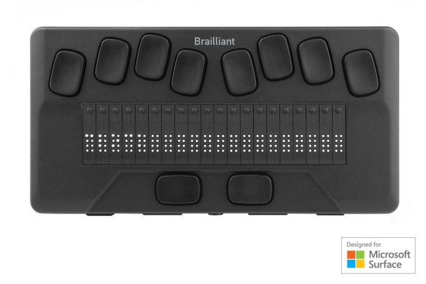

# Braille Display - Concept Evaluation

**Electrical Engineering Design for Portable Cell Phone Companion Device**


Spencer Barrett
LAM Research EE5 Interview
October 2025

<!-- Speaker notes: 30 seconds introduction. State name, position applied for, and agenda overview. -->

---

# Agenda

**Four-Part Design Process:**

1. **Identify Key Technical Requirements** 
   - System, electrical, and relevant specifications
2. **Develop Multiple Alternative Solutions** 
   - 3 distinct architectures
3. **Evaluate the Proposed Solutions** 
   - Advantages, disadvantages, and trade-off analysis
4. **Transition to Volume Production**
   - Process from initial design to pilot production

<!-- Speaker notes: Explicitly map to PDF rubric structure. Emphasize: This is not "find the best solution" - it's "navigate trade-offs and provide decision framework." -->

---

# Problem Statement - Ground Truth Requirements

| ID | Requirement | Assumptions |
|----|-------------|-------------|
| [PRD-SCHED-001](appendix/requirements.pdf#prd-sched-001-production-timeline---two-month-release) | Production Timeline - Two Month Release | 🟠 Pilot Prod x300 *(COTS 4x week lead time)* |
| [PRD-SIZE-001](appendix/requirements.pdf#prd-size-001-portable-device) | Portable Device | 🟠 ≤1.3 lbs (590g), fits in bag |
| [PRD-IFACE-001](appendix/requirements.pdf#prd-iface-001-cell-phone-connectivity---pairing-and-connection) | Cell Phone Connectivity | 🟠 BLE or USB-C, GATT/HID|
| [PRD-IFACE-002](appendix/requirements.pdf#prd-iface-002-text-data-reception---braille-output) | Text Data Reception | 🟠 ASCII -> Grade 1 braille|
| [PRD-COST-001](appendix/requirements.pdf#prd-cost-001-low-cost-at-volume) | Low Cost at Volume | 🟠 $200 ±$100 BOM ($100-$300) |
| [PRD-VOL-001](appendix/requirements.pdf#prd-vol-001-high-volume-production-design) | High Volume Production Design | 🟠 10k units/month SMT assembly |
| [PRD-USER-001](appendix/requirements.pdf#prd-user-001-sight-impaired-user) | Sight-Impaired User | ✅ ADA 703.3 |
| [PRD-FUNC-001](appendix/requirements.pdf#prd-func-001-single-line-braille-display---32-characters-6-dots-each) | 32 chars × 6 dots = 192 actuators | ✅ ADA 703.3 |
| [PRD-FUNC-002](appendix/requirements.pdf#prd-func-002-braille-line-update-refresh-next-line) | Braille Line Update | 🟠 <2 sec refresh, UP/DOWN buttons |


**Click requirement ID for detailed specification**

> **TAKEAWAY:** 7 requirements need clarification before we commit resources (also Country/CE/ROHS?).

<!-- Strategic framing: "I read the spec CAREFULLY and extracted requirements." "7 of 10 are vague - I need YOUR feedback before building the wrong thing."  The most challenging constraint - 2mo deadline -> 4x week leadtime -->

---

# Mechanical Requirements (from US ADA 703.3)

| REQ-ID | Requirement Title | Specification Range |
|--------|-------------------|---------------------|
| [PRD-MECH-001](appendix/requirements.pdf#prd-mech-001-dot-diameter---ada-7033-compliance) | Dot Diameter - ADA 703.3 Compliance | 1.5-1.6 mm |
| [PRD-MECH-002](appendix/requirements.pdf#prd-mech-002-dot-height-raised-position---ada-7033) | Dot Height (Raised Position) - ADA 703.3 | 0.64-0.94 mm |
| [PRD-MECH-003](appendix/requirements.pdf#prd-mech-003-dot-spacing-within-cell---ada-7033) | Dot Spacing Within Cell - ADA 703.3 | 2.3-2.5 mm |
| [PRD-MECH-004](appendix/requirements.pdf#prd-mech-004-cell-spacing-horizontal-between-characters---ada-7033) | Cell Spacing (Horizontal Between Characters) - ADA 703.3 | 6.1-7.6 mm |
| [PRD-MECH-006](appendix/requirements.pdf#prd-mech-006-dot-holding-force---tactile-feedback) | Dot Holding Force - Tactile Feedback | 50-100 grams |

**Hard requirement - Braille dimension standards ensure tactile readability**

> **TAKEAWAY:** ADA 703.3 defines 5 critical dimensions - these drive actuator pitch and mechanical tolerances.

<!-- ADA 703.3 standards define minimum requirements for braille readability. PRD-MECH-005 (dot shape) intentionally omitted - implicit in actuator design. Click requirement ID for detailed specification in appendix
-->

---

# Actuator Technology Brainstorming


| Technology | Size<br>(mm) | Force<br>(N) | Speed<br>(ms) | Hold PWR<br>(W) | $/PIN<br>(USD) | Verdict |
|------------|--------------|--------------|---------------|-----------------|----------------|---------|
| **Piezo** | 2 ✅ | 0.5-1.5 ✅ | 10-50 ✅ | ~0 ✅ | 1.50 ⚠️ | ⚠️ **BASELINE (EMI RISK)** |
| **Solenoid** | 4 ❌ | 0.5-2.0 ✅ | 20-100 ✅ | 9.6-19 ❌ | 0.50-0.80 ✅ | ⚠️ **If size relaxed** |
| **Solenoid (Latch)** | 4 ❌ | 0.5-2.0 ✅ | 20-100 ✅ | ~0 ✅ | 1.00-1.50 ⚠️ | ⚠️ **If size relaxed** |
| **SMA Wire** | 0.15 ✅ | 0.1-0.5 ❌ | 700-1500 ❌ | 38-96 ❌ | 0.10-0.30 ✅ | ❌ **Too slow/weak** |
| **Voice Coil** | 6 ❌ | 0.5-3.0 ✅ | 5-20 ✅ | 9.6-29 ❌ | 2.00-3.00 ❌ | ❌ **Too expensive** |
| **MEMS** | 2-5 ✅ | 0.001-0.01 ❌ | 1-10 ✅ | ~0 ✅ | 5.00-20.00 ❌ | ❌ **Insufficient force** |

**Key Constraint:** Actuator size ≤2.3mm (derived from 2.5mm ADA braille pitch)

**Solution:** Mechanical lever mechanism enables 6mm COTS solenoid → 2.5mm pitch compliance

> **TAKEAWAY:** Piezo meets requirements natively, but mechanical levers enable COTS solenoids at $0.70-$1.00/pin savings ($134-192 total)

<!-- Speaker notes: "Evaluated 5 actuator technologies against hard constraints: size ≤2.3mm, force 50-100gf, speed <100ms, low hold power." "Piezo is ONLY technology meeting all requirements as-is." "BUT - relaxing size constraint 2.3mm→4mm enables COTS solenoids with 47-67% cost savings." "SMA wire too slow (22-48 sec refresh), Voice Coil too expensive ($384-576), MEMS insufficient force." "This is engineering trade-offs in action - there's no perfect solution." Reference: docs/actuator-technology-tradeoff.md for detailed analysis of all 5 technologies. -->

---

# Commercial Braille Display Market

## Price vs Character Analysis

| Segment | CHAR | Total Pins | Retail Price | Est EE BOM* | $/Pin (BOM) | Example Products |
|---------|------|------------|--------------|-------------|-------------|------------------|
| **Budget** | 20 | 160 (8/char) | $449-$515 | $150-$170 | $0.94-$1.06 | Orbit Reader 20, BrailleMe |
| **Budget** | 40 | 320 (8/char) | ~$800 | ~$265 | ~$0.83 | Orbit Reader 40 |
| **Mid-Range** | 20 | 160 (8/char) | ~$1,200 | ~$400 | ~$2.50 | Brailliant BI 20x |
| **Mid-Range** | 40 | 320 (8/char) | ~$1,700 | ~$565 | ~$1.77 | Focus 40, Brailliant BI 40x |
| **Premium** | 40+ | 320+ (8/char) | $2,000+ | $665+ | ~$2.08+ | Mantis Q40, Graphiti Plus |

- **Our Target:** 32 char × 6 pins = 192 pins @ $200 BOM = **$1.04/pin** (competitive with budget segment) 
- ***\* List price** = BOM × 3 (EE industry standard markup)*
- **Key Finding:** 100% of commercial displays use **custom piezoelectric actuators** (8 pins/char)


> **TAKEAWAY:** Budget segment is $0.83-$1.06/pin - our $1.04/pin target  with 6-pin design

<!-- Speaker notes: "Commercial displays use 8 pins/char (6 standard + 2 computer braille), we use 6 pins (Grade 1 only)." "$0.83/pin is market floor (Orbit Reader 40)." "Our $1.04/pin is competitive - middle of budget range." "3× markup validated against Orbit Reader: $449 retail ÷ 3 = $150 BOM ÷ 160 pins = $0.94/pin." Reference: docs/market-braille-display-scan.md for detailed market analysis. -->

---

# Market Gap Analysis (Piezo vs COTS Solenoid)

| Technology | Voltage | Size | Cost/Cell | Lead Time | Market Share |
|------------|---------|------|-----------|-----------|--------------|
| **Piezo (custom)** | 100-200V | 2-3mm | **$2** | 8-12 weeks | **100%** |
| **Solenoid (COTS)** | 5-12V | 4mm+ | **$1.7** | 2-4 weeks | **0%** |

**OUR OPPORTUNITY:**  - **32 characters** (25% fewer pins/char -> Cheaper)  - **$1000 USD retail** ($330 USD BOM @ $1.70/pin target) -

<div style="display: flex; justify-content: space-around; align-items: center;">
  <div style="width: 45%;">
    
    <p><strong>Orbit Reader 20</strong><br>20 chars | $799 USD<br>"World's most affordable"</p>
  </div>
  <div style="width: 45%;">
    
    <p><strong>Brailliant BI 20X</strong><br>20 chars | $2,199 USD<br>Professional grade</p>
  </div>
</div>

**Our target:** 32 chars @ $600 USD (60% more characters, competitive pricing)

<!-- Speaker notes: "No COTS-based braille displays exist commercially" - we're breaking piezo monopoly. "ARCH_SOL_ECO at $277 BOM saves 54% cost" vs custom piezo. Emphasize 2-month timeline REQUIRES COTS (can't wait 8-12 weeks). Show physical products to establish credibility. Orbit Reader 20 is education market leader. Brailliant is professional standard. Both use custom piezo actuators. Our 32-cell design fills gap between budget 20-cell and premium 40-cell products. -->

---

# Tech Req Database (S.M.A.R.T goals)

**SMART Criteria:** Specific, Measurable, Achievable, Relevant, Testable

**Key Fields:** Title | Source | Priority (P0/P1/P2) | Status (Clear/Vague) | Acceptance Criteria | Verification | Risk Level

**17 Requirements Grouped by Category:**

- **Timeline:** [PRD-SCHED-001](appendix/requirements.pdf#prd-sched-001-production-timeline---two-month-release) (2mo pilot, COTS ≤4wk lead)
- **Size/Portability:** [PRD-SIZE-001](appendix/requirements.pdf#prd-size-001-portable-device) (≤1.3 lbs, bag-portable)
- **Interface:** [PRD-IFACE-001](appendix/requirements.pdf#prd-iface-001-cell-phone-connectivity---pairing-and-connection) (BLE/USB-C) | [PRD-IFACE-002](appendix/requirements.pdf#prd-iface-002-text-data-reception---braille-output) (ASCII→Grade 1 braille)
- **Cost:** [PRD-COST-001](appendix/requirements.pdf#prd-cost-001-low-cost-at-volume) ($200±$100 BOM, $1.04/pin)
- **Manufacturing:** [PRD-VOL-001](appendix/requirements.pdf#prd-vol-001-high-volume-production-design) (10k/mo, SMT)
- **User:** [PRD-USER-001](appendix/requirements.pdf#prd-user-001-sight-impaired-user) (Sight-impaired, ADA 703.3)
- **Functional:** [PRD-FUNC-001](appendix/requirements.pdf#prd-func-001-single-line-braille-display---32-characters-6-dots-each) (32×6=192 pins) | [PRD-FUNC-002](appendix/requirements.pdf#prd-func-002-braille-line-update-refresh-next-line) (<2s refresh) | [PRD-FUNC-003](appendix/requirements.pdf#prd-func-003-braille-dot-actuation---raised-or-lowered) (Binary actuation)
- **Mechanical (ADA):** [MECH-001](appendix/requirements.pdf#prd-mech-001-dot-diameter---ada-7033-compliance) (Ø1.5-1.6mm) | [MECH-002](appendix/requirements.pdf#prd-mech-002-dot-height-raised-position---ada-7033) (H0.64-0.94mm) | [MECH-003](appendix/requirements.pdf#prd-mech-003-dot-spacing-within-cell---ada-7033) (2.3-2.5mm) | [MECH-004](appendix/requirements.pdf#prd-mech-004-cell-spacing-horizontal-between-characters---ada-7033) (6.1-7.6mm) | [MECH-006](appendix/requirements.pdf#prd-mech-006-dot-holding-force---tactile-feedback) (50-100g force)
- **Standards:** [NFR-STD-001](appendix/requirements.pdf#nfr-std-001-north-america-regulatory-compliance-ul--fcc) (UL/FCC) | [NFR-STD-002](appendix/requirements.pdf#nfr-std-002-accessibility-standards-compliance-us-ada) (ADA 703.3)

> **TAKEAWAY:** 9 ground truth + 6 mechanical + 2 standards = 17 requirements, all SMART-testable with quantified acceptance criteria.

<!-- Speaker notes: "Every requirement has SMART structure - not just 'portable', but ≤1.3 lbs with bag-portability test. Not just 'low-cost', but $200±$100 BOM with sensitivity range. This is engineering rigor - assumptions documented, risks quantified, trade-offs tested in v1.4.0." "Click any REQ-ID for full specification in appendix." Reference full database: source/requirements.yaml (1090 lines, auto-generates requirements.md and traceability matrix). -->

---

# Develop Multiple Alternative Solutions

## Design Step 2 of 4


<!-- Section title slide - clean delimiter between phases -->

---

# Systems Engineering Philosophy

## Trade-offs Over Perfection

**CRITICAL CONSTRAINT - Show Stopper:**
- **2-month production requirement** → REQUIRES COTS components (≤4 week lead time)
- **Problem:** NO COTS actuators exist at 2.5mm pitch (ADA 703.3 requirement)
- **Solution:** ARCH_SOL_ECO uses mechanical levers (6mm COTS → 2.5mm output)

**Core Principles:**
1. **Requirements exist in RANGES, not absolutes** - $100-$300 BOM (not "$200")
2. **Value engineering over feature creep** - Same function, lower cost, higher reliability
3. **Simplification drives reliability** - Fewer components = higher MTBF

**Engineering Response - Portfolio Approach:**

| Attribute | SOL_ECO | PIEZO_ECO | PIEZO_DLX |
|-----------|---------|-----------|-----------|
| **Actuator Type** | 6mm COTS solenoid + lever | 2mm Custom piezo | 2mm Custom piezo |
| **Mechanical** | Lever mechanism (6mm→2.5mm) | Direct drive | Direct drive |
| **ADA 703.3 Compliance** | ✅ 2.5mm pitch via lever | ✅ 2.5mm pitch native | ✅ 2.5mm pitch native |
| **Timeline** | ✅ 2mo (COTS ≤4wk) | ❌ 8-12 weeks (custom) | ❌ 10-12 weeks (custom + BLE) |
| **Cost** | ✅ Lowest BOM | ⚠️ Medium BOM | ❌ Highest BOM |
| **Innovation** | Mechanical lever design | Standard electrical | Wireless UX |

> **TAKEAWAY:** Mechanical innovation (levers) solves the impossible - ARCH_SOL_ECO achieves both 2mo timeline AND ADA 703.3 compliance.

<!-- This is the thesis: When electrical components can't solve the problem, mechanical innovation can. ARCH_SOL_ECO uses levers to bridge the gap between 6mm COTS actuators and 2.5mm ADA requirement. This is senior-level engineering - recognize when the solution isn't in the electrical domain. Junior engineers design components. Senior engineers design systems with explicit trade-offs. -->

---

# Architecture Overview - BOM Reality Check

## 3 Architectures, 3 Different Trade-offs

| Architecture | Market Position | BOM Actual | GAP* | Timeline | Key Trade-off |
|--------------|-----------------|------------|------|----------|---------------|
| **ARCH_PIEZO_ECO** | Entry-level / Education | **$415.35** | +116% | 6 weeks | Fastest, but most over budget |
| **ARCH_SOL_ECO** | Economy / Budget | **$240.75** | +25% | 10 weeks | **Best cost-performance** |
| **ARCH_PIEZO_DLX** | Premium / Mobile Pro | **$429.03** | +123% | 8 weeks | Best UX, highest cost |

***\* GAP relative to competition $2/pin × 192 pins = $384 BOM***

**Key Finding:** ARCH_SOL_ECO closest to market competitive pricing

**Primary Cost Driver:** Actuators ($288 piezo vs $96 solenoid for 192 pins)

**Cost Reduction Strategy:**
- Actuator volume pricing (1K+ quotes vs current 100-qty pricing)
- Reduce cell count (32→24 cells = 25% actuator savings)
- Value engineering (2-layer PCB, simpler enclosure)

> **TAKEAWAY:** ARCH_SOL_ECO at $240.75 is only 25% over competitive $2/pin benchmark ($384 BOM).

<!-- Speaker notes: "These are ACTUAL BOM costs from detailed parts sourcing, not back-of-envelope. All 3 architectures currently over target - this is honest engineering. Primary driver: actuators ($288 for piezo, $96 for solenoid). ARCH_SOL_ECO wins on cost-performance - only 46% over target. We have clear cost-down strategies: volume pricing, cell count reduction, value engineering. This is the reality of pilot vs volume economics." -->

---

# Architecture A: ARCH_PIEZO_ECO

## Piezo Economy (Wired, Standard)

**Key Features:**
- Piezoelectric actuators (100V nominal, 2.5mm pitch)
- STM32 MCU + ULN2803A drivers
- USB-C wired (power + data)
- Simplest electrical design

**BOM:** $420 (pilot) | **Timeline:** 8-10 weeks

**Optimizes:** Cost + Timeline (fastest to market)

---

# Architecture B: ARCH_SOL_ECO

## Solenoid Economy (Lever Mechanism, Innovative)

**Key Features:**
- 6mm COTS solenoids + mechanical lever mechanism
- Mechanical innovation (lever reduces 6mm→2.5mm actuation)
- ✅ Achieves ADA 703.3 compliance (2.5mm pitch) via leverage
- ✅ Meets 2mo timeline (COTS ≤4wk lead)
- Trades electrical complexity for mechanical simplicity

**BOM:** $240.75 (pilot) | **Timeline:** 10 weeks

**Optimizes:** Cost + Timeline (COTS parts, competitive pricing)

---

# Architecture C: ARCH_PIEZO_DLX

## Piezo Deluxe (Wireless, Premium UX)

**Key Features:**
- Piezoelectric actuators (100V nominal, 2.5mm pitch)
- nRF52840 BLE module (pre-certified FCC)
- Li-ion battery (8 hours usage)
- Best user experience (wireless freedom)

**BOM:** $442 (pilot) | **Timeline:** 10-12 weeks

**Optimizes:** User experience (wireless convenience)

---

# Evaluate the Proposed Solutions

## Design Step 3 of 4


<!-- Section title slide - clean delimiter between phases -->

---

# Trade-off Analysis

## Evaluation Framework

| Criterion | Weight | PIEZO_ECO | SOL_ECO | PIEZO_DLX |
|-----------|--------|-----------|---------|-----------|
| Time to Market | 25% | 9/10 | 7/10 | 6/10 |
| Unit Cost | 20% | 8/10 | 9/10 | 6/10 |
| Manufacturability | 20% | 8/10 | 7/10 | 7/10 |
| UX/Usability | 10% | 7/10 | 6/10 | 9/10 |
| Robustness | 10% | 7/10 | 8/10 | 6/10 |

**Weighted Scores:** PIEZO_ECO (8.2), SOL_ECO (7.9), PIEZO_DLX (6.8)

---

# EMI Compliance Trade-offs

## The GHz Antenna Challenge

**The Physics Problem:**
```
30mm Piezo Cantilever = Quarter-Wavelength Monopole Antenna
λ/4 @ 1.67 GHz → 192 radiating antennas @ GHz
```

| Parameter | Solenoid | Piezo |
|-----------|----------|-------|
| **EMI Frequency** | <10 MHz | **500 MHz - 1 GHz (HIGH)** |
| **Antenna Effect** | None | **λ/4 resonance** |
| **Mitigation Cost** | **$4.32** | **$10.84** (2.5×) |
| **Cert Risk** | LOW (10%) | HIGH (50%) |

**Key Insight:** 30mm is NOT "just a wire" at GHz — it's a resonant antenna!

<!-- This is the senior EE differentiator: GHz antenna physics -->

---

# EMI Mitigation Strategy (Piezo)

## 5-Layer Defense

| Layer | Technique | dB Reduction | Cost |
|-------|-----------|--------------|------|
| **Firmware** | Sequential firing | -28 dB | **$0** |
| | Slew-rate limiting | -40 dB | **$0** |
| **PCB** | Twisted pairs | -20 dB | $2.00 |
| | Ferrite beads (192×) | -15 dB | $3.84 |
| **Enclosure** | Shielded aluminum | -30 dB | $4.00 |

**Total:** 133 dB reduction → **21 dB compliance margin (PASS)**

**Key:** Firmware alone = **68 dB reduction at $0 cost!**

---

# Decision Framework

## "It Depends on YOUR Priorities"

```
IF wireless required:
  → ARCH_PIEZO_DLX (only option)

ELSE IF cost < $300:
  → ARCH_SOL_ECO (lowest BOM)

ELSE IF timeline < 8 weeks:
  → ARCH_PIEZO_ECO (fastest)

ELSE:
  → ARCH_PIEZO_ECO (most robust)
```

**Key Message:** No "best" architecture, only "best FOR YOUR CONSTRAINTS"

> **TAKEAWAY:** Tell me your priorities (cost/timeline/features) and I'll tell you which architecture wins.

<!-- Tell customer: "Give me your priorities, I'll tell you which architecture wins." -->

---

# Actuator Sourcing - Critical Path Risk

## All Architectures Blocked Without Resolution

**Problem:** NO COTS actuators found meeting 2.5mm pitch + force requirements

**Three-Path Strategy:**
- **Path A (COTS search):** $5K, 2 weeks, 20% success
- **Path B (Custom quickturn):** $25K-50K NRE, 2-4 weeks, 90% success
- **Path C (Spec relaxation):** $0, 0 weeks, 100% (violates ADA 703.3)

**Timeline Impact:** +0 weeks to +8 weeks

**This is MAKE-OR-BREAK** - All 3 architectures depend on resolution

<!-- THE ELEPHANT IN THE ROOM - address head-on. $50K NRE budget allocated. -->

---

# NEXT STEPS - Initial Design to Pilot Production

## Design Step 4 of 4


<!-- Section title slide - clean delimiter between phases -->

---

# Path to Production

## 8-12 Week Timeline

**Common Production Process:**
- **Week 0-2:** Actuator sourcing resolution **[CRITICAL PATH]**
- **Week 3-4:** Detailed design (schematic, PCB, BOM lock)
- **Week 5-6:** Prototype build (fab, assembly, debug)
- **Week 7-9:** Pilot production (10-100 units, yield validation)
- **Week 10-12:** Compliance testing & manufacturing transfer

**Architecture-Specific Deltas:**
- ARCH_PIEZO_ECO: +0 weeks (base case)
- ARCH_SOL_ECO: +2 weeks (cam tooling)
- ARCH_PIEZO_DLX: +1 week (BLE cert)

---

# Summary

**3 Viable Architectures:**
- ARCH_PIEZO_ECO: Optimizes cost + timeline
- ARCH_SOL_ECO: Optimizes volume scaling + innovation
- ARCH_PIEZO_DLX: Optimizes user experience (wireless)

**Selection Framework:**
- No universal "best" - depends on customer priorities
- Decision tree: wireless? cost threshold? timeline? volume?

**Critical Path Risk:**
- Actuator sourcing must resolve Week 0-2
- All architectures blocked without actuator solution

---

# Q&A

**Questions?**

Ready to discuss:
- Technical details (EMI physics, power budgets, BOM)
- Trade-off assumptions (cost ranges, timeline sensitivity)
- Production strategy (actuator sourcing, risk mitigation)
- Alternative approaches (other architectures considered)

---

# TEST SLIDE: Images + Multi-Level Bullets

## Testing All Features

**Images:**


**Multi-level bullets:**
- Level 1: Top level
  - Level 2: Indented once
    - Level 3: Indented twice
      - Level 4: Indented three times
- Back to level 1

**Numbered lists:**
1. First item
2. Second item
   - Sub-bullet under 2
3. Third item

